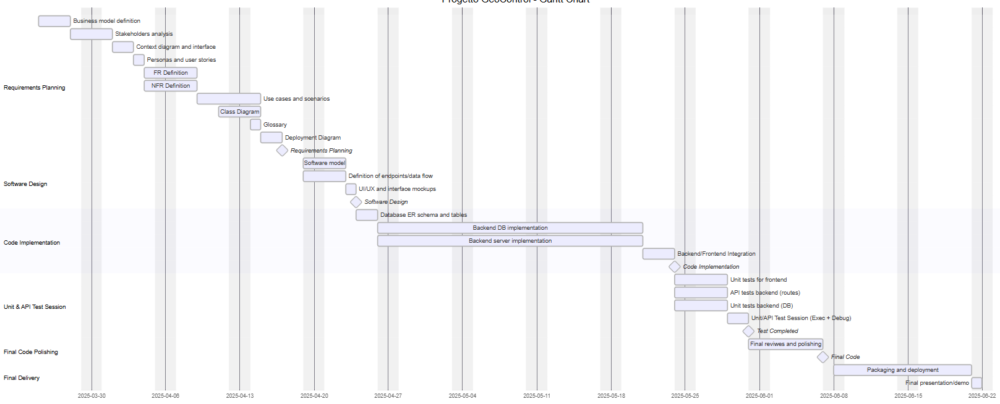

# Project Estimation

Date: 18/04/2025

Version: V1.1 

# Estimation approach

## Estimate by size

|                                                                                                         | Estimate |
| ------------------------------------------------------------------------------------------------------- | -------- |
| NC = Estimated number of classes to be developed                                                        |   25*    |
| A = Estimated average size per class, in LOC                                                            |   100     |
| S = Estimated size of project, in LOC (= NC \* A)                                                       |   2500   |
| E = Estimated effort, in person hours (here use productivity 10 LOC per person hour)                    |   250    |
| C = Estimated cost, in euro (here use 1 person hour cost = 30 euro)                                     |   7500   |
| Estimated calendar time, in calendar weeks (Assume team of 4 people, 8 hours per day, 5 days per week ) |   250/160 = 1.56 weeks       |

*: approx. 10 for models/entities on the server side, 10 for API endpoints/testing, 5 for utils     
## Estimate by product decomposition

| component name       | Estimated effort (person hours) |
| -------------------- | ------------------------------- |
| requirement document |            50                     |
| design document      |            32                     |
| code                 |            100*                     |
| unit tests           |            25**                     |
| api tests            |            15***                     |
| management documents |            20                     |
| **Total** | 242 |

*: estimated: NC = 25 classes, 100 avg LOC per class, productivity P = 25 LOC/h so: $ph = \frac{25 \times 100 \text{ LOC}}{25 \text{ LOC/h}} = 100$ 
*: estimated size of unit tests: 625 LOC ($\sim$ 25% of Code size), productivity 25 LOC per person hour so:  $ph = \frac{625 \text{ LOC}}{25 \text{ LOC/h}} = 25$ 
***: estimated size of API tests: 375 LOC ($\sim$ 15% of code size, the percentage is usually lower than the one for Unit tests since we just have to test the routes here), productivity 25 LOC per person hour so:  $ph = \frac{375 \text{ LOC}}{25 \text{ LOC/h}} = 15$

## Estimate by activity decomposition

| Activity name | Estimated effort (person hours) |
| ------------- | ------------------------------- |
| **1. Requirements Planning**          |    50     |
| 1a. Business model definition         |    2     |
| 1b. Stakeholders analysis             |     4    |
| 1c. Context diagram and interface analysis |  4  |
| 1d. Personas and user stories         |    4     |
| 1e. Functional requirements (FR) definition |  10   |     |
| 1f. Non-functional requirements (NFR) definition |  10  |
| 1g. Use cases and scenarios           |    6     |
| 1h. Class diagram                     |    4     |
| 1i. Glossary                          |    2     |
| 1g. System Diagram                    |   2       |
| 1h. Deployment Diagram               |    2     |
| **2. Software Design**                |    32     |
| 2a. Software model                  |    14
| 2b. Definition of endpoints and data flow |  14   |
| 2c. UI/UX and interface mockups       |     6   |
| **3. Code Implementation**           |     100    |
| 3a. Database ER schema and table creation |  10   |
| 3b. Backend implementation (DB side)  |    35     |
| 3c. Backend implementation (server side) |  45    |
| 3d. Integration between backend and frontend | 10 |
| **4. Unit & API Test Session \***       |   40      |
| 4a. Unit tests for backend (DB side)  |  15       |
| 4b. API tests for backend (server: routes testing) | 10   |
| 4c. Unit tests for front-end components and integration |   5    |
| 4d. Unit/API Test Session |  10   |
| **5. Final reviews and polishing** | 10 |
| **6. Final Project Delivery**         |    10     |
| 6a. Packaging and deployment    |   8      |
| 6b. Final presentation/demo           |    2     |
| **Total** | 242 |

*: the division is: 
- Unit tests: 20 ph dev + 5 ph testing/reviewing
- API tests: 10 ph dev + 5 ph testing/reviewing 

### Gannt Chart

# Summary

|                                    | Estimated effort | Estimated duration |
| ---------------------------------- | ---------------- | ------------------ |
| estimate by size                   |      250 $\text{ph}$            | 1.56 weeks |
| estimate by product decomposition  |       242 $\text{ph}$           | 1.51 weeks |
| estimate by activity decomposition |       242 $\text{ph}$           | 1.51 weeks |

The reason for the slight difference between the first estimation and the other two lies in how we represent the effort and traslate it into a tangible metric, like the $\text{ LOCs}$ that we used in these estimations. In the first one we started the estimation from the perspective of the code (by defining the code size, $A$, from the potential number of classes in the project and and the $\text{avg LOCs}$ per class), and then we applied a Productivity Rate of $10 \text{ LOCs/h}$ in order to extend the estimation to count as well all the other tasks (the ones not related to the implementation like requirements planning, software design etc..). In the other two we defined all the tasks separately and then, *just* for the code part, we plugged in a Productivity Rate of $25 \text{ LOCs/h}$.   The rate of $10 \text{ LOCs/h}$ is lower than the second rate we proposed for just the code because the first estimator weighs in all the work needed to write that line in that specific way, including the effort starting from requirements to the deployment. In the second and third estimators, the rate is just for the code so it's higher because, more realistically, if we have to write the code *after* all the requirement planning and the software design is already done, we'll write it faster.
