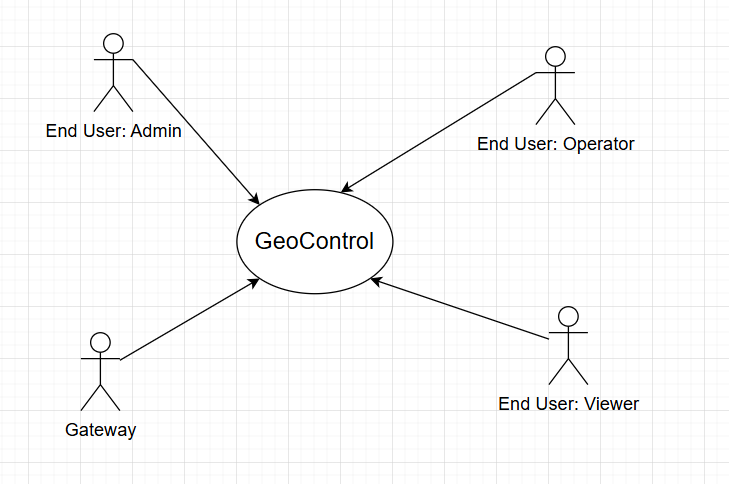

# Requirements Document - GeoControl

Date: 18/04/2025

Version: V1 - description of Geocontrol as described in the swagger

# Contents

- [Requirements Document - GeoControl](#requirements-document---geocontrol)
- [Contents](#contents)
- [Informal description](#informal-description)
- [Business model](#business-model)
- [Stakeholders](#stakeholders)
- [Context Diagram and interfaces](#context-diagram-and-interfaces)
  - [Context Diagram](#context-diagram)
  - [Interfaces](#interfaces)
- [Stories and personas](#stories-and-personas)
  - [User 1 – Admin](#1-admin)
  - [User 2 – Admin](#2-admin)
  - [User 3 – Operator](#3-operator)
  - [User 4 – Operator](#4-operator)
  - [User 5 – Viewer](#5-viewer)
  - [User 6 – Viewer](#6-viewer)
- [Functional and non functional requirements](#functional-and-non-functional-requirements)
  - [Functional Requirements](#functional-requirements)
    - [Table of rights](#fr-table-of-rights)

  - [Non Functional Requirements](#non-functional-requirements)
- [Use case diagram and use cases](#use-case-diagram-and-use-cases)
  - [Use case diagram](#use-case-diagram)
    - [Use case 1 (UC1): Authentication](#use-case-1-uc1-authentication)
      - [Scenario 1.1](#scenario-11)
      - [Scenario 1.2](#scenario-12)
      - [Scenario 1.3](#scenario-13)
      - [Scenario 1.4](#scenario-14)
      - [Scenario 1.5](#scenario-15)
    - [Use case 2 (UC2): User Management – Create a new user](#use-case-2-uc2-user-management---create-a-new-user)
      - [Scenario 2.1](#scenario-21)
      - [Scenario 2.2](#scenario-22)
      - [Scenario 2.3](#scenario-23)
      - [Scenario 2.4](#scenario-24)
    - [Use case 3 (UC3): User Management – Retrieve All Users](#use-case-3-uc3-user-management---retrieve-all-users)
      - [Scenario 3.1](#scenario-31)
      - [Scenario 3.2](#scenario-32)
      - [Scenario 3.3](#scenario-33)
      - [Scenario 3.4](#scenario-34)
    - [Use case 4 (UC4): User Management – Retrieve a Specific User](#use-case-4-uc4-user-management---retrieve-a-specific-user)
      - [Scenario 4.1](#scenario-41)
      - [Scenario 4.2](#scenario-42)
    - [Use case 5 (UC5): User Management – Delete a User](#use-case-5-uc5-user-management---delete-a-user)
      - [Scenario 5.1](#scenario-51)
      - [Scenario 5.2](#scenario-52)
    - [Use case 6 (UC6): Networks Management - Retrieve All Networks](#use-case-6-uc6-networks-management---retrieve-all-networks)
      - [Scenario 6.1](#scenario-61)
    - [Use case 7 (UC7): Networks Management - Create a New Network](#use-case-7-uc7-networks-management---create-a-new-network)
      - [Scenario 7.1](#scenario-71)
    - [Use case 8 (UC8): Networks Management - Retrieve a Specific Network](#use-case-8-uc8-networks-management---retrieve-a-specific-network)
      - [Scenario 8.1](#scenario-81)
    - [Use case 9 (UC9): Networks Management - Update a Network](#use-case-9-uc9-networks-management---update-a-network)
      - [Scenario 9.1](#scenario-91)
    - [Use case 10 (UC10): Networks Management - Delete a Network](#use-case-10-uc10-networks-management---delete-a-network)
      - [Scenario 10.1](#scenario-101)
      - [Scenario 10.2](#scenario-102)
    - [Use case 11 (UC11): Gateways Management - Retrieve All Gateways](#use-case-11-uc11-gateways-management---retrieve-all-gateways-of-a-network)
      - [Scenario 11.1](#scenario-111)
    - [Use case 12 (UC12): Gateways Management - Create a New Gateway](#use-case-12-uc12-gateways-management---create-a-new-gateway-for-a-network)
      - [Scenario 12.1](#scenario-121)
    - [Use case 13 (UC13): Gateways Management - Retrieve a Specific Gateway](#use-case-13-uc13-gateways-management---retrieve-a-specific-gateway)
      - [Scenario 13.1](#scenario-131)
    - [Use case 14 (UC14): Gateways Management - Update a Gateway](#use-case-14-uc14-gateways-management---update-a-gateways-configuration)
      - [Scenario 14.1](#scenario-141)
    - [Use case 15 (UC15): Gateways Management - Delete a Gateway](#use-case-15-uc15-gateways-management---delete-a-gateway-from-a-network)
      - [Scenario 15.1](#scenario-151)
    - [Use case 16 (UC16): Sensors Management - Retrieve All Sensors](#use-case-16-uc16-sensors-management---retrieve-all-sensors-of-a-gateway)
      - [Scenario 16.1](#scenario-161)
    - [Use case 17 (UC17): Sensors Management - Create a New Sensor](#use-case-17-uc17-sensors-management---create-a-new-sensor-for-a-gateway)
      - [Scenario 17.1](#scenario-171)
    - [Use case 18 (UC18): Sensors Management - Retrieve a Specific Sensor](#use-case-18-uc18-sensors-management---retrieve-a-specific-sensor)
      - [Scenario 18.1](#scenario-181)
    - [Use case 19 (UC19): Sensors Management - Update a Sensor](#use-case-19-uc19-sensors-management---update-a-sensor)
      - [Scenario 19.1](#scenario-191)
    - [Use case 20 (UC20): Sensors Management - Delete a Sensor](#use-case-20-uc20-sensors-management---delete-a-sensor)
      - [Scenario 20.1](#scenario-201)
    - [Use case 21 (UC21): Measurements Management - Retrieve Measurements for a set of sensors of a specific network](#use-case-21-uc21-measurements-management---retrieve-measurements-for-a-set-of-sensors-of-a-specific-network)
      - [Scenario 21.1](#scenario-211)
    - [Use case 22 (UC22): Measurements Management - Retrieve only statistics for a set of sensors of a specific network](#use-case-22-uc22-measurements-management---retrieve-only-statistics-for-a-set-of-sensors-of-a-specific-network)
      - [Scenario 22.1](#scenario-221)
    - [Use case 23 (UC23): Measurements Management - Retrieve only Outlier Measurements for a set of sensors of a specific network](#use-case-23-uc23-measurements-management---retrieve-only-outliers-measurements-for-a-set-of-sensors-of-a-specific-network)
      - [Scenario 23.1](#scenario-231)
    - [Use case 24 (UC24): Measurements Management - User Stores Measurements for a Sensor](#use-case-24-uc24-measurements-management---user-stores-measurements-for-a-sensor)
      - [Scenario 24.1](#scenario-241)
    - [Use case 25 (UC25): Measurements Management - Gateway Stores Measurements for a Sensor](#use-case-25-uc25-measurements-management---gateway-stores-measurements-for-a-sensor)
      - [Scenario 25.1](#scenario-251)
      - [Scenario 25.2](#scenario-252)
    - [Use case 26 (UC26): Measurements Management - Retrieve Measurements for a Specific Sensor](#use-case-26-uc26-measurements-management---retrieve-measurements-for-a-specific-sensor)
      - [Scenario 26.1](#scenario-261)
    - [Use case 27 (UC27): Measurements Management - Retrieve Only Statistics for a Specific Sensor](#use-case-27-uc27-measurements-management---retrieve-only-statistics-for-a-specific-sensor)
      - [Scenario 27.1](#scenario-271)
    - [Use case 28 (UC28): Measurements Management - Retrieve Only Outliers for a Specific Sensor](#use-case-28-uc28-measurements-management---retrieve-only-outliers-for-a-specific-sensor)
      - [Scenario 28.1](#scenario-281)

- [Glossary](#glossary)
  - [UML Class Diagram](#uml-class-diagram)
  - [Textual Glossary](#textual-glossary)
- [System Design](#system-design)
  - [Key Components and Responsibilities](#key-components-and-responsibilities)
  - [Interaction Flow](#interaction-flow)
- [Deployment Diagram](#deployment-diagram)

# Informal description

GeoControl is a software system designed for monitoring physical and environmental variables in various contexts: from hydrogeological analyses of mountain areas to the surveillance of historical buildings, and even the control of internal parameters (such as temperature or lighting) in residential or working environments.

# Business Model
The Union of Mountain Communities of Piedmont region faced a pressing challenge in managing and monitoring environmental and physical variables across its territories. In response, the region issued a public tender to find a suitable solution. After a thorough selection process, GeoControl emerged as the winning project, offering a robust system capable of meeting the region’s needs.
The project was initially funded by the Union of Mountain Communities of Piedmont, which provided the necessary capital to cover the due diligence, exploratory analysis, development, and testing phases. Following the successful completion of these stages, a private company was established to continue the project’s development, commercialization, and expansion. Despite the transition to a private entity, the Union of Mountain Communities of Piedmont retained a minority stake in the company. This arrangement allowed the region to maintain a connection to the project while enabling broader business growth, more flexible management, and the potential for wider market reach.
The Business Model is essentialy structured as a **Software As A Service** (*SaaS*): the clients (which are divided into Public entities, such as other regions, regional/state offices, and Private Entities, like private companies operating in the hydrogeological, energy or forestry/lumber markets) are required to pay a monthly subscription to get full access to the software functionalities. The monthly subscription is waived for the Union of Mountain Communities of Piedmont being an early investor of the project.

# Stakeholders

| Stakeholder name | Description |
| :--------------: | :---------: |
| Union of Mountain Communities of Piedmont  |    Principal Commissioner of the project, it uses Geocontrol to manage the hydrogeological state of its territories         |
| Public entities (for ex. other regions, regional/state offices) | Other public entities which may use GeoControl to monitor and manage physical parameters in their areas of competence|
| Private entities (for ex. private companies operating in the hydrogeological, energy or forestry/lumber markets)  | Private companies which may use GeoControl to monitor and manage physical parameters in their areas of competence|
| End User: Admin | Person having full access to all the Geocontrol resources, who can manage both users and networks |
| End User: Operator | Person who can manage networks gateways, sensors and insert measurements |
| End User: Viewer  | Person who can just consult and read data |
| Development Team |  Team composed of SWE, Data Engineers, Data Analysts, Network Engineers, SW Developers that actually project, create, code and test GeoControl |
| Maintenance Team | Team whose aim is to fix the endpoints if they're down and maintain the GeoControl API 
| Network of gateways of sensors | A logical grouping that acts as a container for multiple gateways |
| Gateways of sensors | A physical device uniquely identified by its MAC address, equipped with a network interface, connected to one or more sensors via serial interfaces. Gateways receive measurements from sensors and post them on the server. |
| Sensors | The physical device that actually measures the physical quantity (temperature, inclination, etc.) every 10 minutes and send it to the associated gateway. |

# Context Diagram and interfaces

## Context Diagram

  
*NOTE: sensor is not an actor because it does not directly interact with the GeoControl system. Instead, it communicates exclusively with its  specific gateway, which in turn sends data to the GeoControl server.*  
*The Gateway arrows points to the GeoControl system because it sends measurements to the server itself.*

## Interfaces

|   Actor   | Logical Interface | Physical Interface |
| :-------: | :---------------: | :----------------: |
| End User: Admin |    Web Interface         | PC, Smartphone              |
| End User: Operator |   Web Interface          | PC, Smartphone              |
| End User: Viewer |  Web Interface           | PC, Smartphone              |
| Gateway | API POST Endpoint | Wireless Connection |

# Stories and personas

### 1) Admin:
- **Profession:** Head of Operations @ Eni Plenitude
- **Age:** 60
- **Main skills:** Project Management, some Environmental/Geotechnical domain (they must be aware of hydrogeological risks, environmental variables, like temperature, humidity, soil movement, etc.), Human resources management, decision planning.
- **Main tasks:** Coordinate the Energy Data Department, by managing sensors and extracting useful data. They also manage human resources inside the department, by assigning tasks to other employees.
- **Current State of Art:** They are currently working in a fragmented and divided environment, they have multiple separate databases/excel files for storing measurements inserted manually. Their main challenge is the lack of optimization, which makes the entire process highly time-consuming and inefficient. Moreover, they are not very suited with the current technological means.
- **How can GeoControl solve their problems?** Speed up and automation of critical tasks and make them less prone to human errors, have access to automatic, personalised and reliable calculations and statistical analysis. Also, GeoControl, being fully vertically integrated, can simplify their job by giving them the possibility to use a single platform to manage everything, thus overcoming their potential technological disadvantage.
- **How do they interact with GeoControl?** each task corresponds to an individual transaction applied to GeoControl. Each transaction is created by accessing GeoControl endpoints, set up to manage networks, gateways and sensors. Admins, and only admins, can also manage human resources like users. 

To summarize, they can:
  - add new users
  - delete and manage users
  - create new networks from the ground up by:
    - adding new sensors
    - adding new gateways
    - formalize the network structure
  - they can also change and delete networks by:
    - changing or deleting sensors
    - changing and deleting gateways
    - changing and deleting networks
  - they can visualize and insert sensors measures (although measurements are for the most part automatically inserted by gateways)

### 2) Admin:
- **Profession:** The technical administrator of the municipality of the city of Bardonecchia
- **Age:** 40
- **Main skills:** Environmental/Geotechnical domain (they must be aware of hydrogeological risks, environmental variables, like temperature, humidity, soil movement, etc.) in order to manage the technical and environmental area of Bardonecchia (a mountain municipality), human resources management, decision planning, institutional Communication. 
- **Main task:** Manage the technical and environmental area of Bardonecchia by managing the whole sensor's networks and profiling them. They also have to communicate with regional authorities, vendors, and stakeholders on how to use the sensors data to enhance the municipality decisions on environmental matters.
- **Current State of Art:** They are currently working in a fragmented and divided environment, they have multiple separate databases/excel files for storing measurements inserted manually. Their main challenge is the lack of optimization, which makes the entire process highly time-consuming and inefficient. Also, Bardonecchia currently relies on small distinct sensors networks, so data are extracted by different multiple sources and is not always structured and formatted in the same way.
- **How can GeoControl solve their problems?** Speed up and automation of critical tasks and make them less prone to human errors, have access to automatic, personalised and reliable calculations and statistical analysis. Also, GeoControl, being fully vertically integrated, can simplify their job by giving them the possibility to use a single platform to merge all the sensors networks in one place.
- **How do they interact with GeoControl?** each task corresponds to an individual transaction applied to GeoControl. Each transaction is created by accessing GeoControl endpoints, set up to manage networks, gateways and sensors. Admins, and only admins, can also manage human resources like users.

To summarize, they can:
  - add new users
  - delete and manage users
  - create new networks from the ground up by:
    - adding new sensors
    - adding new gateways
    - formalize the network structure
  - they can also change and delete networks by:
    - changing or deleting sensors
    - changing and deleting gateways
    - changing and deleting networks
  - they can visualize and insert sensors measures (although measurements are for the most part automatically inserted by gateways)

### 3) Operator:
- **Profession:** Network Engineer for Cisco, Cisco NatureWatcher network
- **Age:** 57
- **Main Skills:** Strong background in networking protocols, edge computing, and IoT infrastructure deployment. Skilled in configuring gateways, optimizing network topologies, and troubleshooting connectivity issues in remote environments.
- **Main Tasks:** Responsible for designing and maintaining the communication infrastructure between various sensors installed on the Cisco NatureWatcher network. Often works in challenging environments to ensure stable data flow, performs on-site diagnostics, and updates firmware or network settings on remote gateways.
- **Current State of the Art:** Uses fragmented tools to manage devices, often needing to SSH into each node manually. Firmware updates and connectivity checks require multiple steps and physical intervention. Lack of a unified interface makes coordination with field teams slow and error-prone.
- **How can GeoControl solve their problems?** GeoControl provides a centralized interface to monitor the entire device network, enabling remote diagnostics and updates, streamlining configuration tasks, and reducing the need for on-site interventions. It also allows the engineer to visualize network performance metrics and connectivity health in real time.
- **How do they interact with GeoControl?** They have access to most admin-level features related to device and gateway management, but they do not handle user administration. Their role is focused on maintaining the network layer and ensuring data is flowing reliably through the system.

### 4) Operator:
- **Profession:** Environmental Operator at a consortium that deals with environmental monitoring in mountain areas
- **Age:** 30
- **Main skills:** Skilled in installing, replacing, and maintaining sensors and gateways. 
- **Main tasks:** They have to monitor sensors data in real time and check all the devices are currently working OK. Their duty is also to manually insert new data on the consortium database system.
- **Current State of the Art:** They have to experience very long procedures to register, update or remove sensors from both the physical and logical networks
- **How can GeoControl solve their problems?** GeoControl can offer every perk previously listed; another important advantage is that, since both Operators and Admin share the same platform, everything is more synchronized and everyone uses a single complete platform. As a result, both communication and access times for data transferring are sped up.
- **How do they interact with GeoControl?** They are able to perform the same task as Admins, but they aren't allowed to access user-related functionalities (like CRUDing users).

### 5) Viewer:
- **Profession:** Business Analyst for RealAnalyses.com
- **Age:** 40
- **Main skills:** Extract relevant information and patterns from data, by applying predictive and machine learning algorithms.
- **Current state of the Art:** They aim to extract patterns from data but they are forced to use multiple platforms to access many different data, which are also formatted in the most different ways. This causes a rather large overhead because they have to spend time to fix all this conflicts. They also have to pay subscriptions to multiple data sources.
- **How can GeoControl solve their problems?** GeoControl can offer every perk previously listed; Being one single platform, they now have to pay just one subscription to have access to all the network data. Another important advantage is that, since both Operators, Viewers and Admins share the same platform, everything is more synchronized and everyone uses a single complete platform. As a result, communication times are sped up.
- **How do they interact with GeoControl?** They are only able to access the GET endpoints to visualize data.

### 6) Viewer:
- **Profession:** Environmental Risk Consultant at TerraScope Analytics
- **Age:** 45
- **Main Skills:** Expertise in geospatial data analysis, environmental risk modeling, and interpretation of satellite imagery and sensor data. Skilled in GIS platforms and Python-based analytics.
- **Current State of the Art:** Uses a variety of disconnected tools and manual data collection methods to monitor environmental risks, often relying on outdated data sources or custom scripts to preprocess inconsistent datasets. This limits their ability to respond quickly to critical environmental events.
- **How can GeoControl solve their problems?** GeoControl allows them to access up-to-date, harmonized data from various sensors and locations through a single dashboard. This eliminates the need for manual data wrangling and reduces the risk of missing crucial signals. The platform also helps maintain alignment with field Operators and Admins, ensuring quick validation and response when potential threats arise.
- **How do they interact with GeoControl?** They access only the GET endpoints, using the platform to visualize risk indicators, historical trends, and alert patterns through intuitive dashboards and map-based interfaces.

# Functional and non functional requirements

## Functional Requirements

|  ID   | Description |
| :---: | :---------: |
| **FR0** | **Authorization and authentication**  |
| FR0.1| User sign-in using username and password |
| | |
| **FR1** | **User management** |
|  FR1.1  | User Sign-up (Create a new user with username, password and type of user)           |
|  FR1.2 | Get all the created users |
| FR1.3 | Get the info of a specific user by specifying their username |
| FR1.4 |  Delete a specific user by specifying their username |
| | |
| **FR2** | **Network Management** |
|  FR2.1  | New network Creation (Create a new network with its network code, name and description)            |
|  FR2.2 | Get all the created networks |
| FR2.3 | Get the info of a specific network by specifying its network code |
| FR2.4| Update a specific network by specifying its network code, name and description |
| FR2.5 |  Delete a specific network by specifying its network code |
| | |
| **FR3** | **Gateways Management** |
|  FR3.1  | New gateway Creation (Create a new gateway within an existent network using network code, mac address, name and description)            |
|  FR3.2 | Get all the created gateways within an existent network by passing the network code|
| FR3.3 | Get the info of a specific gateway within an existent network by specifying its network code and mac address|
| FR3.4| Update a specific gateway within an existent network by specifying its network code, mac address, name and description |
| FR3.5 |  Delete a specific gateway within an existent network by specifying its network code and mac address|
| | |
| **FR4** | **Sensors Management** |
|  FR4.1  | New sensor Creation (Create a new sensor for an existent gateway using the gateway network code, gateway mac address and the sensor mac address, name, description, variable, unit)            |
|  FR4.2 | Get all the created sensors for an existent gateway by passing the gateway network code and the gateway mac address|
| FR4.3 | Get the info of a specific sensor for an existent gateway by specifying the gateway network code, the gateway mac address and the sensor mac address|
| FR4.4| Update a specific sensor for an existent gateway by specifying its gateway network code, the gateway mac address and the sensor mac address, name and description, variable, unit |
| FR4.5 |  Delete a specific sensor within an existent network by specifying its network code and mac address|
| | |
| **FR5** |**Measurement Management** |
| FR5.1 | Store a specific sensor measurement by passing the gateway network code and mac address, the sensor mac address and the "createdAt" and value of measurement |
| FR5.2| Get all measurements for a set of sensors in a specific network by passing the network code (which is the unique required parameter), sensor mac addresses, startDate and endDate (both following the ISO 8601 format) |
| FR5.3 | Get *only* statistics for a set of sensor of a specific network by passing the network code (which is the unique required parameter), sensor mac addresses, startDate and endDate (both following the ISO 8601 format) |
| FR5.4 | Get *only* outliers for a set of sensor of a specific network by passing the network code (which is the unique required parameter), sensor mac addresses, startDate and endDate (both following the ISO 8601 format) |
|FR5.5| Get measurements associated with a specific sensor by passing the network code, the gateway mac address, the sensor mac (these 3 are the only required parameters), startDate and endDate (both following the ISO 8601 format)  |
|FR5.6 | Get *only* statistics associated with a specific sensor by passing the network code, the gateway mac address, the sensor mac (these 3 are the only required parameters), startDate and endDate (both following the ISO 8601 format)|
|FR5.7 | Get *only* outliers associated with a specific sensor by passing the network code, the gateway mac address, the sensor mac (these 3 are the only required parameters), startDate and endDate (both following the ISO 8601 format)|
           
### FR: Table of rights

| Functional Requirement             | Admin | Operator | Viewer | Gateway
|-----------------------------------|:-----:|:--------:|:------:|:------:|
| **FR0 – Auth & Auth**             |    |        |      |
|   FR0.1 - User sign-in         | ✅    | ✅       | ✅     | ❌ |
| **FR1 – User Management**         |     |       |      |      |
| FR1.1 – Create user               | ✅    | ❌       | ❌     | ❌     |
| FR1.2 – Get all users             | ✅    | ❌       | ❌     | ❌     |
| FR1.3 – Get user info             | ✅    | ❌       | ❌     | ❌     |
| FR1.4 – Delete user               | ✅    | ❌       | ❌     | ❌     |
| **FR2 – Network Management**      |     |        |      |
| FR2.1 – Create network            | ✅    | ✅       | ❌     | ❌     |
| FR2.2 – Get all networks          | ✅    | ✅       | ✅     | ❌     |
| FR2.3 – Get network info          | ✅    | ✅       | ✅     | ❌     |
| FR2.4 – Update network            | ✅    | ✅       | ❌     | ❌     |
| FR2.5 – Delete network            | ✅    | ✅       | ❌     | ❌     |
| **FR3 – Gateway Management**      |    |        |     | |
| FR3.1 – Create gateway            | ✅    | ✅       | ❌     | ❌     |
| FR3.2 – Get all gateways          | ✅    | ✅       | ✅     | ❌     |
| FR3.3 – Get gateway info          | ✅    | ✅       | ✅     | ❌     |
| FR3.4 – Update gateway            | ✅    | ✅       | ❌     | ❌     |
| FR3.5 – Delete gateway            | ✅    | ✅       | ❌     | ❌     |
| **FR4 – Sensor Management**       |     |        |      | |
| FR4.1 – Create sensor             | ✅    | ✅       | ❌     | ❌     |
| FR4.2 – Get all sensors           | ✅    | ✅       | ✅     | ❌     |
| FR4.3 – Get sensor info           | ✅    | ✅       | ✅     | ❌     |
| FR4.4 – Update sensor             | ✅    | ✅       | ❌     | ❌     |
| FR4.5 – Delete sensor             | ✅    | ✅       | ❌     | ❌     |
| **FR5 – Measurement Management**  |     |        |      | |
| FR5.1 – Store measurement         | ✅    | ✅       | ❌     | ✅     |
| FR5.2 – Get measurements (bulk)   | ✅    | ✅       | ✅     | ❌     |
| FR5.3 – Get stats (bulk)          | ✅    | ✅       | ✅     | ❌     |
| FR5.4 – Get outliers (bulk)       | ✅    | ✅       | ✅     | ❌     |
| FR5.5 – Get sensor measurements   | ✅    | ✅       | ✅     | ❌     |
| FR5.6 – Get sensor stats          | ✅    | ✅       | ✅     | ❌     |
| FR5.7 – Get sensor outliers       | ✅    | ✅       | ✅     | ❌     |

## Non Functional Requirements

|   ID    | Type | Description | Refers to |
| :-----: | :--------------------------------: | :---------: | :-------: |
|  NFR1   |      *Usability*                              |    Users on smartphone are able to put their credentials and authenticate  in <  1 min       |  FR0         |
|  NFR2   |            *Usability*                        |     Desktop users are able to put their credentials and authenticate  in <  30 sec       |  FR0         |
|  NFR3   |             *Usability*                       |     Every distinct page is accessible within maximum 3 clicks    |    all FRs       |
|  NFR4 | *Usability* | The client interface is compatible with the WCAG 2.1 Accessibility Standards, A Level | all FRs |
| NFR5 | *Usability* | Effort to learn how to use the whole page < 45 min | all FRs |
| NFR6 | *Efficiency* | Response time for all the functions in normal server conditions (except for the Sign-in which is < 1 min): < 0.5 sec| all FRs |
| NFR7 | *Reliability* | No more than six measurements per year, per sensor, are lost| FR5 |
| NFR8 | *Reliability* | No response, unexpected shutdown, freeze < 3 per user per year | all FRs |
| NFR9 | *Reliability* | Availability of server: 99.999% on one year (0.3 days) | all FRs |
| NFR10 | *Portability* | Web app should be available on browser: Chrome from 135, Safari from 18.4, Firefox from 137, Edge from 134, Opera from 116, Chrome for Android from 135, Safari for iOS from 18.4, Samsung Internet from 127, Firefox for Android from 137| all FRs |
| NFR11 | *Maintainability* | Effort to fix a defect < 1 person month | all FRs |
| NFR12 | *Maintainability* | System update can be performed in < 1.5 hour | all FRs |
| NFR13 | *Security* | End users of type "Operator" and "Viewer" cannot access in any way any info related to users | FR1 |
| NFR14 | *Security* | External web site visitors (not signed-up) are not able to access any information or resources | all FRs |
| NFR15 | *Security* | Passwords must be stored using a secure one-way hashing algorithm (e.g., bcrypt) | FR0, FR1 |

# Use case diagram and use cases

## Use case diagram

*NOTE: We defined macro-Areas such as Sensor Management, Gateways Management etc to simplify the structure of the diagram and make it more readable*

### Use Case 1 (UC1): Authentication

| Actors Involved  | Admin, Operator, Viewer |
| :--------------: | :---------------------: |
| **Precondition** | A registered user exists and the system is running and accessible. |
| **Post condition** | The user is authenticated and can access the website|
| **Nominal Scenario** | The user enters the login info (username and password) and sends a POST to the server, which checks the credentials and validates them in order to log the user in.  |
| **Variants** |  |
| **Exceptions** | - **400 Invalid input data:** If required fields are missing or malformed. - **401 Invalid username or password:** If the username/password combination is invalid. - **404 User not found:** If the user does not exist. - **500 Internal server error:** Any unexpected backend issues. |

#### Scenario 1.1
|  Scenario 1.1| (Nominal Scenario - 200)                                                                           |
| :------------: | :------------------------------------------------------------------------: |
|  Precondition  | A registered user exists and the system is running and accessible. |
| Post condition | The user is authenticated and can access the website  |
|     **Step#**      |  **Description**                                 |
| 1 | The user navigates to the login interface. |
| 2 | The user enters their (correct) username and password.       |
| 3 | The client submits a POST request to the `/auth` endpoint with a JSON payload (e.g., `{ "username": "s0123465", "password": "FR90!5g@+ni" }`).|
| 4 |  The system validates the credentials against the user store, returns *200*. |
| 5 | Token generated successfully: the user is logged-in |

#### Scenario 1.2

|  Scenario 1.2| (Invalid input data - 400) |
| :------------: | :---------------------------: |
|  Precondition  | A registered user exists and the system is running and accessible. |
| Post condition | The user is not authenticated. An error (400 - BadRequest) is returned. |
|     **Step#**      | **Description** |
| 1 | The user navigates to the login interface. |
| 2 | The user enters their username (not the password).       |
| 3 | The user submits a POST request to the `/auth` endpoint with a JSON payload (e.g., `{ "username": "s0123465" }`). |
| 4 | The server receives the malformed request and returns a *400 - BadRequest* error. |
| 5 | The client displays an error message: "Missing required fields." |

#### Scenario 1.3

|  Scenario 1.3| (Invalid username or password - 401) |
| :------------: | :---------------------------: |
|  Precondition  | A registered user exists and the system is running and accessible. |
| Post condition | The user is not authenticated. An error (401 - Invalid username or password) is returned. |
|     **Step#**      | **Description** |
| 1 | The user navigates to the login interface. |
| 2 | The user enters their (wrong) username and password.       |
| 3 | The client submits a POST request to the `/auth` endpoint with a JSON payload (e.g., `{ "username": "s0123465", "password": "XXXXxxxx" }`).|
| 4 | The server compares credentials and returns a *401 - UnauthorizedError*. |
| 5 | The client displays an error message: "Invalid username or password." |

#### Scenario 1.4

|  Scenario 1.4| (User Not Found - 404) |
| :------------: | :---------------------------: |
|  Precondition  | A non-registered user is used for the login and the system is running and accessible. |
| Post condition | The user is not authenticated. An error (404 - User Not Found) is returned. |
|     **Step#**      | **Description** |
| 1 | The user navigates to the login interface. |
| 2 | The user enters their username and password, the username does not exist in the system. |
| 3 | The client submits a POST request to the `/auth` endpoint with a JSON payload (e.g., `{ "username": "a000000", "password": "FR90!5g@+ni" }`).|
| 4 | The server cannot find the user and returns a *404 - NotFoundError*. |
| 5 | The client displays an error message: "User not found." |

#### Scenario 1.5

|  Scenario 1.5| (Internal Server Error - 500) |
| :------------: | :---------------------------: |
|  Precondition  | A registered user exists but a backend error occurs (e.g., DB is down). |
| Post condition | The user is not authenticated. An error (500 - Internal Server Error) is returned. |
|     **Step#**      | **Description** |
| 1 | The user navigates to the login interface. |
| 2 | The user enters their (correct) username and password. |
| 3 | The client submits a POST request to the `/auth` endpoint with a JSON payload (e.g., `{ "username": "s0123465", "password": "FR90!5g@+ni" }`).|
| 4 | The server encounters an unexpected error (e.g., DB unavailable) and returns a *500 -  InternalServerError*. |
| 5 | The client displays a message: "Unexpected error. Please try again later." |

### Use case 2 (UC2): User Management - Create a new user

| Actors Involved  | Admin |
| :--------------: | :---: |
| **Precondition** | Admin user is authenticated and holds a valid token and the system is running and accessible. |
| **Post condition** | A new user is created in the system. |
| **Nominal Scenario** | Admin sends a POST request to `/users` with valid user data. The system creates the user and responds with *201 - User created*. |
| **Variants** |  |
| **Exceptions** | - **400 Invalid input data:** if required fields are missing or malformed. - **401 Unauthorized:** if no or invalid token is provided. - **403 Insufficient Rights** if user is not an Admin. - **409 Username already in use** if the username already exists. - **500 Internal server error** for unexpected issues. |

#### Scenario 2.1

|  Scenario 2.1| (Nominal scenario - 200) |
| :------------: | :------------------------------: |
| Precondition | Admin is authenticated and the system is running and accessible. |
| Post condition | The new user is created. |
| **Step#** | **Description** |
| 1 | Admin accesses the user creation interface. |
| 2 | Admin fills in `username`, `password`, and `type`. |
| 3 | Client sends POST to `/users` with a JSON payload (e.g., `{ "username": "s0123465", "password": "FR90!5g@+ni", "type": "admin" }`). |
| 4 | Server validates and creates the user, returns *201*. |
| 5 | Client shows confirmation to Admin. |

#### Scenario 2.2

|  Scenario 2.2 | (Unauthorized - 401) |
| :-----------: | :-----------------------------: |
| Precondition | Admin is not properly authenticated and the system is running and accessible. |
| Post condition | Action is blocked, 401 error. |
| **Step#** | **Description** |
| 1 | Admin accesses the user creation interface. |
| 2 | Admin fills in `username`, `password`, and `type`. |
| 3 | Client sends POST to `/users` with a JSON payload (e.g., `{ "username": "s0123465", "password": "FR90!5g@+ni", "type": "admin" }`) with no or expired token. |
| 4 | The server returns a *401 - UnauthorizedError*. |
| 5 | The client displays an error message: "The token is not valid: please authenticate again in order to proceed." |

#### Scenario 2.3 

|  Scenario 2.3 | (Insufficient rights - 403) |
| :-----------: | :-----------------------------: |
| Precondition | A non-admin user attempts to access the endpoint and the system is running and accessible. |
| Post condition | Action is blocked, 403 error. |
| **Step#** | **Description** |
| 1 | Operator tries to send a POST to `/users` with a JSON payload (e.g., `{ "username": "s0123465", "password": "FR90!5g@+ni", "type": "admin" }`). |
| 2 | The server returns *403 - InsufficientRightsError*. |

#### Scenario 2.4

|  Scenario 2.4 | (Username already in use - 409) |
| :-----------: | :-----------------------------: |
| Precondition | Admin is authenticated and the system is running and accessible. |
| Post condition | No user is created, 409 error. |
| **Step#** | **Description** |
| 1 | Admin accesses the user creation interface. |
| 2 | Admin fills in `username`, `password`, and `type`, with an username already in use|
| 3 | Client sends POST to `/users` with a JSON payload (e.g., `{ "username": "s0123465", "password": "FR90!5g@+ni", "type": "admin" }`). |
| 4 | Server returns 409 Conflict with message `"User with code xxxxx already exists"`. |
| 5 | The server finds an existing user with the same username and returns a *409 - ConflictError*. |
| 6 | The client displays an error message: "Already existing username: please choose another one." |

### Use Case 3 (UC3): User Management - Retrieve All Users

| Actors Involved  | Admin |
| :--------------: | :---: |
| **Precondition** | Admin user is authenticated with a valid token and the system is running and accessible. |
| **Post condition** | The system returns a list of all users. |
| **Nominal Scenario** | Admin sends a GET request to `/users`. The server validates the token and returns all user records. |
| **Variants** | |
| **Exceptions** | - **401 Unauthorized**: token is missing or invalid. - **403 Insufficient Rights**: user is not an admin. - **500 Internal Server Error**: backend issue. |

#### Scenario 3.1

|  Scenario 3.1 | (Nominal scenario - 200) |
| :-----------: | :------------------------: |
| Precondition | Admin is authenticated and the system is running and accessible. |
| Post condition | List of users is returned. |
| **Step#** | **Description** |
| 1 | Admin accesses the user management panel. |
| 2 | Client sends a GET request to `/users` with his token. |
| 3 | Server verifies token and role, returns *200* |
| 4 | Client shows the list of users. |

#### Scenario 3.2

| Scenario 3.2 | (Unauthorized - 401) |
| :----------: | :------------------: |
| Precondition | The token is missing or invalid. |
| Post condition | The request is rejected with an error message. |
| **Step#** | **Description** |
| 1 | Admin accesses the user management panel. |
| 2 | Client sends a GET request to `/users` **without a token or with an expired/invalid token**. |
| 3 | Server detects the missing/invalid token and returns *401 Unauthorized*. |
| 4 | Client shows an authentication error and prompts the user to log in again. |

#### Scenario 3.3

| Scenario 3.3 | (Forbidden - 403) |
| :----------: | :----------------: |
| Precondition | A non-admin user tries to access the user list. |
| Post condition | The request is rejected with a *403 Forbidden*. |
| **Step#** | **Description** |
| 1 | A regular user tries to access the user management panel. |
| 2 | Client sends a GET request to `/users` with a valid token. |
| 3 | Server verifies the token and role, determines user is not admin, and returns *403 Forbidden*. |
| 4 | Client shows an authorization error message and cannot proceed further. |

#### Scenario 3.4

| Scenario 3.4 | (Internal Server Error - 500) |
| :----------: | :----------------------------: |
| Precondition | Admin is authenticated but the backend service encounters a failure. |
| Post condition | The system returns a *500 Internal Server Error*. |
| **Step#** | **Description** |
| 1 | Admin accesses the user management panel. |
| 2 | Client sends a GET request to `/users` with a valid token. |
| 3 | Server tries to retrieve user data but fails due to an internal issue (e.g., DB connection failure). |
| 4 | Server returns *500 Internal Server Error*. |
| 5 | Client shows a generic error message or "Try again later". |

### Use Case 4 (UC4): User Management - Retrieve a Specific User

| Actors Involved  | Admin |
| :--------------: | :---: |
| **Precondition** | Admin is authenticated with a valid token and the system is running and accessible. |
| **Post condition** | The server returns details of the requested user. |
| **Nominal Scenario** | Admin sends GET request to `/users/{username}` and receives the corresponding user data. |
| **Variants** |  |
| **Exceptions** | - **401 Unauthorized** if token is missing or invalid. - **403 Insufficient Rights** if user is not an admin. - **404 User Not Found** if user does not exist. - **500 Internal Server Error** for backend issues. |

#### Scenario 4.1

| Scenario 4.1 | (Nominal scenario - 200) |
| :----------: | :-------------------------------: |
| Precondition | Admin is authenticated with a valid token and the system is running and accessible. |
| Post condition | The requested user's info is displayed |
| **Step#** | **Description** |
| 1 | Admin accesses the user management panel. |
| 2 | Admin searches for user `s123456`. |
| 3 | Client sends GET to `/users/s123456`. |
| 4 | Server verifies token and role. |
| 5 | Server returns 200 OK with the user's data. |

#### Scenario 4.2

| Scenario 4.2 | (User not found - 404) |
| :----------: | :------------------------------: |
| Precondition | Admin is authenticated with a valid token and the system is running and accessible. |
| Post condition | The user is returned, error 404 is returned. |
| **Step#** | **Description** |
| 1 | Admin accesses the user management panel. |
| 2 | Admin searches for user `a000000`. |
| 2 | Admin tries to access `/users/a000000`. |
| 3 | Server checks user existence and returns a *404 - NotFoundError*. |
| 5 | The client displays an error message: "User not found." |

### Use Case 5 (UC5): User Management - Delete a User 

| Actors Involved  | Admin |
| :--------------: | :---: |
| **Precondition** | Admin is authenticated with a valid token and the system is running and accessible. |
| **Post condition** | The specified user is removed from the system. |
| **Nominal Scenario** | Admin sends DELETE request to `/users/{username}`. The system removes the user and returns 204 (No Content). |
| **Variants** | |
| **Exceptions** | - **401 Unauthorized** if invalid or wrong token is present. - **403 Insufficient Rights** if role is not Admin. - **404 User Not Found** if user doesn't exist. - **500 Internal Server Error** if backend fails. |

#### Scenario 5.1 

| Scenario 5.1 | (Nominal scenario - 204) |
| :----------: | :-------------------: |
| Precondition | Admin is authenticated with a valid token and the system is running and accessible. |
| Post condition | The user is removed from the system. |
| **Step#** | **Description** |
| 1 | Admin accesses the user management panel. |
| 2 | Admin selects user `s123456` to delete. |
| 3 | Client sends DELETE request to `/users/s123456`. |
| 4 | Server verifies token and role. |
| 5 | Server deletes user and returns *204*. | 

#### Scenario 5.2

| Scenario 5.2 | (User Not Found - 404) |
| :----------: | :---------------------: |
| Precondition | Admin is authenticated with a valid token and the system is running and accessible. |
| Post condition | System returns a 404 error indicating the user to be deleted does not exist. |
| **Step#** | **Description** |
| 1 | Admin accesses the user management panel. |
| 2 | Admin selects a user `s999999` (non-existent) to delete. |
| 3 | Client sends DELETE request to `/users/s999999`. |
| 4 | Server verifies token and role. |
| 5 | Server does not find the specified user and returns *404 Not Found*. |
| 6 | Client shows a "User not found" error message, and the deletion is not succesful. |

### Use Case 6 (UC6): Networks Management - Retrieve all networks

| Actors Involved  | Admin, Operator, Viewer |
| :--------------: | :---------------------: |
| **Precondition** | Authenticated user with valid token and the system is running and accessible. |
| **Post condition** | Network list is retrieved. |
| **Nominal Scenario** | The user sends a GET request to `/networks`. The server returns 200 with the requested data. |
| **Variants** |  |
| **Exceptions** | - **401 Unauthorized** if token is missing or invalid. -  **500 Internal Server Error** for backend issues. |

#### Scenario 6.1 

| Scenario 6.1 | (Nominal scenario - 200) |
| :----------: | :-------------------------------------------: |
| Precondition | User is authenticated with valid token and the system is running and accessible. |
| Post condition | A list of networks is returned. |
| **Step#** | **Description** |
| 1 | User navigates to the network overview. |
| 2 | Client sends GET request to `/networks`. |
| 3 | Server verifies token and role, returns *200* |
| 4 | Client shows the list of networks. |

### Use Case 7 (UC7): Networks Management - Create a New Network

| Actors Involved  | Admin, Operator |
| :--------------: | :-------------: |
| **Precondition** | Admin is authenticated with a valid token and the system is running and accessible. |
| **Post condition** | A new network is created. |
| **Nominal Scenario** | The user sends a POST request to `/networks` with valid data. The server creates the network and returns 201. |
| **Variants** |  |
| **Exceptions** | - **400 Invalid input data** for invalid or missing fields. - **401 Unauthorized** if token is missing or invalid. - **403 Insufficient Rights** for Viewers. - **409 Network code already in use** if network code already exists. - **500 Internal Server Error** for backend issues. |

#### Scenario 7.1

| Scenario 7.1 | (Nominal scenario – 201) |
| :----------: | :------------------------------: |
| Precondition | Admin is authenticated with a valid token and the system is running and accessible. |
| Post condition | Network is successfully created |
| **Step#** | **Description** |
| 1 | User accesses the create network form. |
| 2 | Fills in `code`, `name`, and `description`. |
| 3 | Client sends POST request to `/networks` with JSON payload (e.g., `{ "code": "NET01", "name": "Alp Monitor", "description": "Alpine Weather Monitoring Network }`). |
| 4 | Server validates and creates the network, returns *201*. |
| 5 | Client shows confirmation to User. |

### Use Case 8 (UC8): Networks Management - Retrieve a Specific Network

| Actors Involved  | Admin, Operator, Viewer |
| :--------------: | :---------------------: |
| **Precondition** | User is authenticated with a valid token and the system is running and accessible. |
| **Post condition** | The specific network information is retrieved. |
| **Nominal Scenario** | The user sends a GET request to `/networks/{networkCode}` and receives the network details. |
| **Variants** | |
| **Exceptions** | - **401 Unauthorized** if token is invalid. - **404 Network Not Found** if the network code does not exist. - **500 Internal Server Error** for backend issues. |

#### Scenario 8.1

| Scenario 8.1 | (Nominal scenario – 200) |
| :----------: | :--------------------------: |
| Precondition | Authenticated Admin or Operator with valid token, the selected network exists, the system is running and accessible. |
| Post condition | Network details are returned |
| **Step#** | **Description** |
| 1 | User navigates to the network overview. |
| 1 | User selects a network (e.g., `NET001`). |
| 2 | Client sends GET to `/networks/NET001`. |
| 3 | Server validates token, returns *200*. |
| 4 | Client shows the network info. |

### Use Case 9 (UC9): Networks Management - Update a Network

| Actors Involved  | Admin, Operator |
| :--------------: | :-------------: |
| **Precondition** | User is authenticated with a valid token and the system is running and accessible. |
| **Post condition** | The specified network is updated. |
| **Nominal Scenario** | The user sends a PATCH request to `/networks/{networkCode}` with new values. |
| **Variants** | |
| **Exceptions** | - **400 Invalid Input Data** for invalid/missing data. - **401 Unauthorized** for missing/expired token. - **403 Insufficient Rights** for Viewers. - **404 Network Not Found** if the network doesn't exist. - **409 Network code already in use** if new code conflicts with existing one. - **500 Internal Server Error** for backend issues. |

#### Scenario 9.1

| Scenario 9.1 | (Nominal scenario – 204 No Content) |
| :----------: | :-----------------------------: |
| Precondition | Authenticated Admin or Operator with valid token, the selected network exists, the system is running and accessible. |
| Post condition | Network info is updated |
| **Step#** | **Description** |
| 1 | User chooses to edit a network (e.g., `NET01`). |
| 2 | Updates name and description in UI. |
| 3 | Client sends PATCH request to `/networks/NET01`. |
| 4 | Server validates and applies changes. |
| 5 | Server returns 204 No Content to notify network has been updated succesfully. |

### Use Case 10 (UC10): Networks Management - Delete a Network

| Actors Involved  | Admin, Operator |
| :--------------: | :-------------: |
| **Precondition** | User is authenticated with a valid token and the system is running and accessible. |
| **Post condition** | The specified network is deleted from the system. |
| **Nominal Scenario** | The user sends a DELETE request to `/networks/{networkCode}`. The server deletes the record and returns 204. |
| **Variants** | |
| **Exceptions** | - **401 Unauthorized** for invalid/missing token. - **403 Insufficient Rights** for Viewers. - **404 Network Not Found** if network doesn’t exist. - **500 Internal Server Error** for backend failures. |

#### Scenario 10.1

| Scenario 10.1 | (Nominal scenario – 204 No Content) |
| :-----------: | :-----------------------------: |
| Precondition | Authenticated Admin or Operator with valid token, the selected network exists, the system is running and accessible. |
| Post condition | Network is deleted |
| **Step#** | **Description** |
| 1 | User navigates to the network overview. |
| 2 | User selects a network (e.g., `NET001`) to be deleted. |
| 3 | Client sends DELETE request to `/networks/NET01`. |
| 5 | Server deletes the network and returns *204*. | 

#### Scenario 10.2

| Scenario 10.2 | (Network Not Found – 404) |
| :-----------: | :------------------------: |
| Precondition | Authenticated Admin or Operator with valid token, the system is running and accessible. |
| Post condition | Server responds with 404 Not Found |
| **Step#** | **Description** |
| 1 | User selects a non-existent network `NET99` for deletion. |
| 2 | Client sends DELETE request to `/networks/NET99`. |
| 3 | Server validates the token and role. |
| 4 | Server does not find the specified network in the database. |
| 5 | Server returns *404 Not Found*. |
| 6 | Client displays a "Network not found" error message. |

### Use Case 11 (UC11): Gateways Management - Retrieve All Gateways of a Network

| Actors Involved  | Admin, Operator, Viewer |
| :--------------: | :---------------------: |
| **Precondition** | User is authenticated with a valid token and the system is running and accessible. |
| **Post condition** | Returns a list of Gateways associated with the given network. |
| **Nominal Scenario** | The user sends a GET request to `/networks/{networkCode}/gateways`. The server returns a list of gateways with 200 OK. |
| **Variants** |  |
| **Exceptions** | - **401 Unauthorized** for invalid/missing token. - **404 Network Not Found** if network does not exist. - **500 Internal Server Error** for backend failures. |

#### Scenario 11.1

| Scenario 11.1 | (Nominal scenario – 200) |
| :----------: | :--------------------------: |
| Precondition | Authenticated Admin or Operator with valid token, the selected network exists, the system is running and accessible. |
| Post condition | Gateways details within a specific network are returned |
| **Step#** | **Description** |
| 1 | User navigates to the network gateways overview. |
| 2 | User selects a network (e.g., `NET001`). |
| 3 | Client sends GET to `/networks/NET001/gateways`. |
| 4 | Server validates token, returns *200*. |
| 5 | Client shows the gateways info for all gateways belonging to that specific network. |

### Use Case 12 (UC12): Gateways Management - Create a new Gateway for a Network

| Actors Involved  | Admin, Operator |
| :--------------: | :-------------: |
| **Precondition** | User is authenticated with a valid token and the system is running and accessible. |
| **Post condition** | The specified gateway is associated with the selected network. |
| **Nominal Scenario** | The user sends a POST request to `/networks/{networkCode}/gateways` with gateway data in the body. The server registers the gateway and returns 201 Created. |
| **Variants** | |
| **Exceptions** | - **400 Invalid Input Data** for invalid/missing data. - **401 Unauthorized** for invalid/missing token. - **403 Insufficient Rights** for Viewer roles. - **404 Network Not Found** if the network doesn’t exist. - **409 Gateway mac address already in use** if the gateway already exists. - **500 Internal Server Error** for backend failures. |

#### Scenario 12.1

| Scenario 12.1 | (Nominal scenario – 201) |
| :----------: | :------------------------------: |
| Precondition | Authenticated Admin or Operator with valid token, the selected network exists, the system is running and accessible. |
| Post condition | Gateways is successfully created withing the selected network. |
| **Step#** | **Description** |
| 1 | User selects a network (e.g., `NET001`). |
| 2 | User accesses the create gateways form inside the network panel. |
| 3 | Fills in `macAddress`, `name`, and `description`. |
| 4 | Client sends POST request to `/networks/{networkCode}/gateways` with JSON payload (e.g., `{ "macAddress": "94:3F:BE:4C:4A:79", "name": "GW01", "description": "on-field aggregation node" }`). |
| 5 | Server validates and adds the gateway to the selected network, returns *201*. |
| 6 | Client shows confirmation to User. |

### Use Case 13 (UC13): Gateways Management - Retrieve a Specific Gateway

| Actors Involved  | Admin, Operator, Viewer |
| :--------------: | :---------------------: |
| **Precondition** | User is authenticated with a valid token and the system is running and accessible. |
| **Post condition** | Returns the gateway with the specified MAC address. |
| **Nominal Scenario** | The user sends a GET request to `/networks/{networkCode}/gateways/{gatewayMac}`. The server returns the gateway with 200 OK. |
| **Variants** | |
| **Exceptions** | - **401 Unauthorized** for invalid/missing token. - **404 Network/Gateway not found** if network or gateway doesn't exist. - **500 Internal Server Error** for backend failures. |

#### Scenario 13.1

| Scenario 13.1 | (Nominal scenario – 200) |
| :----------: | :------------------------------: |
| Precondition | Authenticated Admin or Operator with valid token, the selected network exists, the gateway exists within the selected network, the system is running and accessible. |
| Post condition | Server returns the requested gateway information. |
| **Step#** | **Description** |
| 1 | User navigates to the network overview. |
| 2 | User selects a network (e.g., `NET001`). |
| 3 | User identifies the MAC address of the gateway to look up (e.g., `94:3F:BE:4C:4A:79`). |
| 4 | Client sends GET request to `/networks/{networkCode}/gateways/{gatewayMac}` (e.g. `/networks/NET001/gateways/94:3F:BE:4C:4A:79`). |
| 5 | Server authenticates and checks access rights. |
| 6 | Server retrieves the gateway data and returns it with *200 OK*. |
| 7 | Client displays the gateway info to the User. |

### Use Case 14 (UC14): Gateways Management - Update a Gateway's Configuration

| Actors Involved  | Admin, Operator |
| :--------------: | :-------------: |
| **Precondition** | User is authenticated with a valid token and the system is running and accessible. |
| **Post condition** | The specified gateway inside a selected network is updated with the new configuration. |
| **Nominal Scenario** | The user sends a PUT request to `/networks/{networkCode}/gateways/{gatewayMac}` with updated gateway data in the body. The server updates the gateway and returns 200 OK. |
| **Variants** | |
| **Exceptions** | - **400 Invalid Input Data** for invalid/missing data. - **401 Unauthorized** for invalid/missing token. - **403 Insufficient Rights** for Viewer roles. - **404 Network/Gateway not found** if network or gateway doesn't exist. - **409 Gateway mac address already in use** if the gateway already exists. - **500 Internal Server Error** for backend failures. |

#### Scenario 14.1

| Scenario 14.1 | (Nominal scenario – 200) |
| :----------: | :------------------------------: |
| Precondition | Authenticated Admin or Operator with valid token and the gateway exists within the selected network. |
| Post condition | The gateway is successfully updated with the new configuration. |
| **Step#** | **Description** |
| 1 | User navigates to the network overview. |
| 2 | User selects a network (e.g., `NET001`) |
| 3 | User identifies the MAC address of the gateway to update (e.g., `94:3F:BE:4C:4A:79`). |
| 4 | UI presents an edit form with current gateway details. |
| 5 | User updates `macAddress`, `name`, `description` |
| 6 | Client sends PUT request to `/networks/NET001/gateways/94:3F:BE:4C:4A:79` with the updated JSON payload (e.g., `{ "macAddress": "1C:6A:66:95:EE:45", "name": "GW01 Updated", "description": "updated description" }`). |
| 7 | Server validates the data and updates the gateway information. |
| 8 | Server returns *200 OK* with updated gateway information. |
| 9 | Client displays confirmation of the update to the user. |

### Use Case 15 (UC15): Gateways Management - Delete a Gateway from a Network

| Actors Involved  | Admin, Operator |
| :--------------: | :-------------: |
| **Precondition** | User is authenticated with a valid token and the system is running and accessible. |
| **Post condition** | The specified gateway is removed from the network. |
| **Nominal Scenario** | The user sends a DELETE request to `/networks/{networkCode}/gateways/{gatewayMac}`. The server deletes the association and returns 204 No Content. |
| **Variants** |  |
| **Exceptions** | - **401 Unauthorized** for invalid/missing token. - **403 Insufficient Rights** for Viewer roles. - **404 Network/Gateway not found** if network or gateway doesn't exist. -  **500 Internal Server Error** for backend failures. |

#### Scenario 15.1

| Scenario 15.1 | (Nominal scenario – 204) |
| :----------: | :------------------------------: |
| Precondition | Authenticated Admin or Operator with valid token, the selected network exists, the gateway exists within the selected network, the system is running and accessible. |
| Post condition | The gateway is removed from the specified network. |
| **Step#** | **Description** |
| 1 | User navigates to the network overview. |
| 2 | User selects a network (e.g., `NET001`) |
| 3 | Inside the specific network, user selects a gateway to delete (e.g., `94:3F:BE:4C:4A:79`). |
| 4 | UI asks for confirmation, user confirms. |
| 5 | Client sends DELETE request to `/networks/{networkCode}/gateways/{gatewayMac}` (e.g. `/networks/NET001/gateways/94:3F:BE:4C:4A:79`). |
| 6 | Server validates request and deletes the association. |
| 7 | Server returns *204 No Content*. |
| 8 | Client updates UI and confirms deletion. |

### Use Case 16 (UC16): Sensors Management - Retrieve All Sensors of a Gateway

| Actors Involved  | Admin, Operator, Viewer |
| :--------------: | :-----------------: |
| **Precondition** | User is authenticated with a valid token and the system is running and accessible. |
| **Post condition** | A list of sensors of the selected gateway is returned. |
| **Nominal Scenario** | The user sends a GET request to `/networks/{networkCode}/gateways/{gatewayMac}/sensors` to retrieve all sensors of the gateway. The server returns 200 OK with the list of sensors. |
| **Variants** | |
| **Exceptions** | - **401 Unauthorized** for invalid/missing token. - **404 Network/Gateway not found** if the network or gateway doesn’t exist. - **500 Internal Server Error** for backend failures. |

#### Scenario 16.1

| Scenario 16.1 | (Nominal scenario – 200) |
| :----------: | :-----------------------------: |
| Precondition | Authenticated user (Admin, Operator, or Viewer) with valid token and the selected gateway exists. |
| Post condition | A list of sensors for the specified gateway is successfully retrieved. |
| **Step#** | **Description** |
| 1 | User navigates to the network overview. |
| 2 | User selects a network (e.g., `NET001`) and a gateway (e.g., `94:3F:BE:4C:4A:79`). |
| 3 | User sends GET request to `/networks/{networkCode}/gateways/{gatewayMac}/sensors` (e.g. `/networks/NET001/gateways/94:3F:BE:4C:4A:79/sensors`). |
| 4 | Server processes the request and returns a list of sensors with *200 OK*. |
| 5 | Client displays the list of sensors to the user. |

### Use Case 17 (UC17): Sensors Management - Create a New Sensor for a Gateway

| Actors Involved  | Admin, Operator |
| :--------------: | :-------------: |
| **Precondition** | User is authenticated with a valid token and the system is running and accessible. |
| **Post condition** | A new sensor is created and associated with the specified gateway. |
| **Nominal Scenario** | The user sends a POST request to `/networks/{networkCode}/gateways/{gatewayMac}/sensors` with sensor data. The server creates the sensor and returns 201 Created. |
| **Variants** | |
| **Exceptions** | - **400 Invalid Input Data** for invalid/missing data. -  - **401 Unauthorized** for invalid/missing token. - **403 Insufficient Rights** for Viewer roles. - **404 Network/Gateway not found** if network or gateway doesn't exist. - **409 Sensor mac address already in use** if the sensor MAC address already exists. - **500 Internal Server Error** for backend failures. |

#### Scenario 17.1

| Scenario 17.1 | (Nominal scenario – 201) |
| :----------: | :-------------------------------: |
| Precondition | Authenticated Admin or Operator with valid token and the selected network and gateway exist. |
| Post condition | A new sensor is successfully created and associated with the specified gateway. |
| **Step#** | **Description** |
| 1 | User navigates to the network overview. |
| 2 | User selects a network (e.g., `NET001`) and a gateway (e.g., `94:3F:BE:4C:4A:79`). |
| 3 | User accesses the create sensor form for the selected gateway. |
| 4 | User fills in the sensor data (e.g., `macAddress`, `name`, `description`, `variable`, `unit`). |
| 5 | User sends a POST request to `/networks/{networkCode}/gateways/{gatewayMac}/sensors` (e.g. `/networks/NET001/gateways/94:3F:BE:4C:4A:79/sensors`) with the sensor JSON data. |
| 6 | Server validates the data and creates the sensor, returning *201 Created*. |
| 7 | Client shows confirmation to the user. |

### Use Case 18 (UC18): Sensors Management - Retrieve a Specific Sensor

| Actors Involved  | Admin, Operator, Viewer |
| :--------------: | :-----------------: |
| **Precondition** | User is authenticated with a valid token and the system is running and accessible. |
| **Post condition** | The specified sensor's details are returned. |
| **Nominal Scenario** | The user sends a GET request to `/networks/{networkCode}/gateways/{gatewayMac}/sensors/{sensorMac}` to retrieve a specific sensor's details. The server returns 200 OK with the sensor data. |
| **Variants** | |
| **Exceptions** | - **401 Unauthorized** for invalid/missing token. - **Network/Gateway/Sensor not found** if the network, gateway, or sensor doesn’t exist. - **500 Internal Server Error** for backend failures. |

#### Scenario 18.1

| Scenario 18.1 | (Nominal scenario – 200) |
| :----------: | :-------------------------------: |
| Precondition | Authenticated user (Admin, Operator, or Viewer) with valid token and the specified sensor exists. |
| Post condition | The details of the specified sensor are successfully retrieved. |
| **Step#** | **Description** |
| 1 | User navigates to the network overview. |
| 2 | User selects a network (e.g., `NET001`), a gateway (e.g., `94:3F:BE:4C:4A:79`), and a sensor (e.g., `4F:72:D2:6B:3B:27`). |
| 3 | User sends GET request to `/networks/{networkCode}/gateways/{gatewayMac}/sensors/{sensorMac}` (e.g. `/networks/NET001/gateways/94:3F:BE:4C:4A:79/sensors/4F:72:D2:6B:3B:27`). |
| 4 | Server processes the request and returns the sensor data with *200 OK*. |
| 5 | Client displays the sensor details to the user. |

### Use Case 19 (UC19): Sensors Management - Update a Sensor

| Actors Involved  | Admin, Operator |
| :--------------: | :-------------: |
| **Precondition** | User is authenticated with a valid token and the system is running and accessible. |
| **Post condition** | The specified sensor is updated with the new configuration. |
| **Nominal Scenario** | The user sends a PATCH request to `/networks/{networkCode}/gateways/{gatewayMac}/sensors/{sensorMac}` with updated sensor data. The server updates the sensor and returns 204 No Content. |
| **Variants** | |
| **Exceptions** | - **400 Invalid Input Data** for invalid/missing data. - **401 Unauthorized** for invalid/missing token. - **403 Insufficient Rights** for Viewer roles. - **404 Network/Gateway/Sensor not found** if the network, gateway, or sensor doesn’t exist. - **409 Sensor mac address already in use** if the sensor MAC address already exists. - **500 Internal Server Error** for backend failures. |

#### Scenario 19.1

| Scenario 19.1 | (Nominal scenario – 204) |
| :----------: | :-------------------------------: |
| Precondition | Authenticated Admin or Operator with valid token, the selected network, gateway and sensor exist and the system is running and accessible. |
| Post condition | The sensor is successfully updated with the new configuration. |
| **Step#** | **Description** |
| 1 | User navigates to the network overview. |
| 2 | User selects a network (e.g., `NET001`), a gateway (e.g., `94:3F:BE:4C:4A:79`), and a sensor (e.g., `4F:72:D2:6B:3B:27`). |
| 3 | User accesses the edit form for the selected sensor. |
| 4 | User updates the sensor's `name`, `description`, or other fields. |
| 5 | User sends PATCH request to `/networks/{networkCode}/gateways/{gatewayMac}/sensors/{sensorMac}` (e.g. `/networks/NET001/gateways/94:3F:BE:4C:4A:79/sensors/4F:72:D2:6B:3B:27`) with the updated JSON data. |
| 6 | Server processes the request and returns *204 No Content*. |
| 7 | Client shows confirmation to the user. |

### Use Case 20 (UC20): Sensors Management - Delete a Sensor

| Actors Involved  | Admin, Operator |
| :--------------: | :-------------: |
| **Precondition** | User is authenticated with a valid token and the system is running and accessible. |
| **Post condition** | The specified sensor is deleted. |
| **Nominal Scenario** | The user sends a DELETE request to `/networks/{networkCode}/gateways/{gatewayMac}/sensors/{sensorMac}` to delete a sensor. The server deletes the sensor and returns 204 No Content. |
| **Variants** | |
| **Exceptions** | - **401 Unauthorized** for invalid/missing token. - **403 Insufficient Rights** for Viewer roles. - **404 Network/Gateway/Sensor not found** if the network, gateway, or sensor doesn’t exist. - **500 Internal Server Error** for backend failures. |

#### Scenario 20.1

| Scenario 20.1 | (Nominal scenario – 204) |
| :----------: | :-------------------------------: |
| Precondition | Authenticated Admin or Operator with valid token, the selected network, gateway and sensor exist and the system is running and accessible. |
| Post condition | The sensor is successfully deleted from the gateway. |
| **Step#** | **Description** |
| 1 | User navigates to the network overview. |
| 2 | User selects a network (e.g., `NET001`), a gateway (e.g., `94:3F:BE:4C:4A:79`), and a sensor (e.g., `4F:72:D2:6B:3B:27`). |
| 3 | User sends DELETE request to `/networks/{networkCode}/gateways/{gatewayMac}/sensors/{sensorMac}` (e.g. `/networks/NET001/gateways/94:3F:BE:4C:4A:79/sensors/4F:72:D2:6B:3B:27`). |
| 4 | Server processes the request and deletes the sensor, returning *204 No Content*. |
| 5 | Client shows confirmation to the user. |

### Use Case 21 (UC21): Measurements Management - Retrieve Measurements for a set of sensors of a specific network

| Actors Involved  | Admin, Operator, Viewer |
| :--------------: | :---------------------: |
| **Precondition** | User is authenticated and the network exists and the system is running and accessible. |
| **Post condition** | A list of measurements is returned for sensors within the network. |
| **Nominal Scenario** | The user sends a GET request to `/networks/{networkCode}/measurements` with optional filters (e.g., sensorMacs, startDate, endDate). The server returns 200 OK with filtered results. |
| **Variants** | |
| **Exceptions** | - **401 Unauthorized** if not authenticated. - **404 Network Not Found** if network does not exist. - **500 Internal Server Error** on backend error. |

#### Scenario 21.1

| Scenario 21.1 | (Nominal scenario – 200) |
| :----------: | :-----------------------------: |
| Precondition | Authenticated user and network exists and the system is running and accessible. |
| Post condition | Measurements for the network are displayed. |
| **Step#** | **Description** |
| 1 | User navigates to the network overview. |
| 2 | User selects a network (e.g., `NET001`) |
| 3 | Client sends GET request to `/networks/{networkCode}/measurements` (e.g. `/networks/NET001/measurements`). |
| 4 | Server retrieves matching measurements and returns *200* with JSON data. |
| 5 | Client displays results on the dashboard. |

### Use Case 22 (UC22): Measurements Management - Retrieve only statistics for a set of sensors of a specific network

| Actors Involved  | Admin, Operator |
| :--------------: | :-------------: |
| **Precondition** | Authenticated user, network exists, data available for sensors and the system is running and accessible. |
| **Post condition** | Summary statistics (e.g., mean, variance) are returned. |
| **Nominal Scenario** | The user sends a GET request to `/networks/{networkCode}/stats` with optional filters (e.g., sensorMacs, startDate, endDate). The server returns 200 OK with statistical data. |
| **Variants** | |
| **Exceptions** | - **401 Unauthorized** for invalid token. - **404 Network Not Found** if network doesn’t exist. - **500 Internal Server Error** on backend errors. |

#### Scenario 22.1

| Scenario 22.1 | (Nominal scenario – 200) |
| :----------: | :-----------------------------: |
| Precondition | Valid session and network is active and the system is running and accessible. |
| Post condition | Statistics are returned. |
| **Step#** | **Description** |
| 1 | User navigates to the network overview. |
| 2 | User selects a network (e.g., `NET001`) |
| 3 | Client sends GET request to `/networks/{networkCode}/stats` (e.g. `/networks/NET001/stats`). |
| 4 | Server retrieves matching measurement stats and returns *200* with JSON data. |
| 5 | Client displays results on the dashboard. |

### Use Case 23 (UC23): Measurements Management - Retrieve only outliers measurements for a set of sensors of a specific network

| Actors Involved  | Admin, Operator |
| :--------------: | :-------------: |
| **Precondition** | Authenticated user and network exists and the system is running and accessible. |
| **Post condition** | Outlier measurements are returned. |
| **Nominal Scenario** | The user sends a GET request to `/networks/{networkCode}/outliers` with optional filters (e.g., sensorMacs, startDate, endDate). The server returns 200 OK with the outlier measurements. |
| **Variants** | |
| **Exceptions** | - **401 Unauthorized** if token is missing. - **404 Network Not Found** if network not found. - **500 Internal Server Error** on backend error. |

#### Scenario 23.1

| Scenario 23.1 | (Nominal scenario – 200) |
| :----------: | :-----------------------------: |
| Precondition | Authenticated session and valid network and the system is running and accessible. |
| Post condition | Outliers are returned to user. |
| **Step#** | **Description** |
| 1 | User navigates to the network overview. |
| 2 | User selects a network (e.g., `NET001`) |
| 3 | Client sends GET request to `/networks/{networkCode}/outliers` (e.g. `/networks/NET001/outliers`). |
| 4 | Server retrieves matching measurement outliers and returns *200* with JSON data. |
| 5 | Client displays results on the dashboard. |

### Use Case 24 (UC24): Measurements Management - User stores Measurements for a Sensor

| Actors Involved  | Admin, Operator |
| :--------------: | :-------------: |
| **Precondition** | User is authenticated with a valid token, the sensor Mac Address, gateways Mac address, network code are already saved in GeoControl, and the system is running and accessible. |
| **Post condition** | A new measurement is stored for the sensor. |
| **Nominal Scenario** | The user sends a POST request to `/networks/{networkCode}/gateways/{gatewayMac}/sensors/{sensorMac}/measurements` with measurements data. The server returns 201 Created. |
| **Variants** | |
| **Exceptions** | - **400 Invalid input data** for invalid or missing fields. - **401 Unauthorized** if token is missing or invalid. - **403 Insufficient Rights** for Viewers.  -**404 Network/Gateway/Sensor not found** for invalid/not recognized sensor Mac Address, gateways Mac address, network code.  - **500 Internal Server Error** on backend error. |

#### Scenario 24.1

| Scenario 24.1 | (Nominal scenario – 201) |
| :----------: | :-------------------------------: |
| Precondition | Sensor and gateways are connected to the network can communicate; the sensor Mac Address, gateways Mac address, network code are already saved in GeoControl, and the system is running and accessible. |
| Post condition | A new measurement is successfully created and associated with the specified sensor. |
| **Step#** | **Description** |
| 1 | User navigates to the network overview. |
| 2 | User selects a network (e.g., `NET001`) and a gateway (e.g., `94:3F:BE:4C:4A:79`) and a sensor (e.g., `4F:72:D2:6B:3B:27`). |
| 3 | User accesses the create measurement form for the selected sensor. |
| 4 | User fills in the measurement data (e.g., `createdAt`, `value`). |
| 5 | User sends a POST request to `/networks/{networkCode}/gateways/{gatewayMac}/sensors/{sensorMac}/measurements` (e.g. `/networks/NET001/gateways/94:3F:BE:4C:4A:79/sensors/4F:72:D2:6B:3B:27/measurements`) with the measurement JSON data. |
| 6 | Server validates the data and creates the measurement, returning *201 Created*. |
| 7 | Client shows confirmation to the user. |

### Use Case 25 (UC25): Measurements Management - Gateway stores Measurements for a Sensor

| Actors Involved  | Gateway |
| :--------------: | :-------------: |
| **Precondition** | Sensor and gateways are connected to the network can communicate; the sensor Mac Address, gateways Mac address, network code are already saved in GeoControl, and the system is running and accessible. |
| **Post condition** | A new measurement is stored for the sensor. |
| **Nominal Scenario** | The user sends a POST request to `/networks/{networkCode}/gateways/{gatewayMac}/sensors/{sensorMac}/measurements` with measurements data. The server returns 201 Created. |
| **Variants** | |
| **Exceptions** | - **400 Invalid input data** for invalid or missing fields. - **401 Unauthorized** if token is missing or invalid. - **403 Insufficient Rights** for Viewers.  -**404 Network/Gateway/Sensor not found** for invalid/not recognized sensor Mac Address, gateways Mac address, network code.  - **500 Internal Server Error** on backend error. |

#### Scenario 25.1

| Scenario 25.1 | (Nominal scenario – 201) |
| :----------: | :-------------------------------: |
| Precondition | Sensor and gateways are connected to the network can communicate; the sensor Mac Address, gateways Mac address, network code are already saved in GeoControl, and the system is running and accessible. |
| Post condition | A new measurement is successfully created and associated with the specified sensor. |
| **Step#** | **Description** |
| 1 | Gateway sends a *POST Http* request to `/networks/{networkCode}/gateways/{gatewayMac}/sensors/{sensorMac}/measurements` (e.g. `/networks/NET001/gateways/94:3F:BE:4C:4A:79/sensors/4F:72:D2:6B:3B:27/measurements`) with the measurement JSON data. |
| 2 | The server looks up the networkCode, gatewayMac, sensorMac |
| 3 | Server validates the data and creates the measurement, returning *201 Created*. |

#### Scenario 25.2

| Scenario 25.2 | (Invalid arguments: invalid/not recognized sensor Mac Address, gateways Mac address, network code – 404) |
| :----------: | :-------------------------------: |
| Precondition | Sensor and gateways are connected to the network can communicate; the sensor Mac Address, gateways Mac address, network code are **not** saved in GeoControl, and the system is running and accessible. |
| Post condition | An error 404 is returned by the system |
| **Step#** | **Description** |
| 1 | Gateway sends a *POST Http* request to `/networks/{networkCode}/gateways/{gatewayMac}/sensors/{sensorMac}/measurements` (e.g. `/networks/NET001/gateways/94:3F:BE:4C:4A:79/sensors/4F:72:D2:6B:3B:27/measurements`) with the measurement JSON data. |
| 2 | The server looks up the networkCode, gatewayMac, sensorMac |
| 3 | Either one, two, or all the codes are nto present in the server returns a *404 - NotFound* error. | 

### Use Case 26 (UC26): Measurements Management - Retrieve Measurements for a specific sensor

| Actors Involved  | Admin, Operator, Viewer |
| :--------------: | :---------------------: |
| **Precondition** | User is authenticated and the network exists and the system is running and accessible. |
| **Post condition** | A list of measurements is returned for the selected sensor. |
| **Nominal Scenario** | The user sends a GET request to `/networks/{networkCode}/gateways/{gatewayMac}/sensors/{sensorMac}/measurements` with optional filters (startDate, endDate). The server returns 200 OK with filtered results. |
| **Variants** | |
| **Exceptions** | - **401 Unauthorized** if not authenticated. - **404 Network/Gateway/Sensor not found** if network/gateway/sensor not found. - **500 Internal Server Error** on backend error. |

#### Scenario 26.1

| Scenario 26.1 | (Nominal scenario – 200) |
| :----------: | :-----------------------------: |
| Precondition | Authenticated user and network exists and the system is running and accessible. |
| Post condition | Measurements for the sensor are displayed. |
| **Step#** | **Description** |
| 1 | User navigates to the network overview. |
| 2 | User selects a network (e.g., `NET001`) and a gateway (e.g., `94:3F:BE:4C:4A:79`) and a sensor (e.g., `4F:72:D2:6B:3B:27`). |
| 3 | Client sends GET request to `/networks/{networkCode}/gateways/{gatewayMac}/sensors/{sensorMac}/measurements` (e.g. `/networks/NET001/gateways/94:3F:BE:4C:4A:79/sensors/4F:72:D2:6B:3B:27/measurements`). |
| 4 | Server retrieves matching measurements and returns *200* with JSON data. |
| 5 | Client displays results on the dashboard. |

### Use Case 27 (UC27): Measurements Management - Retrieve statistics for a specific sensor

| Actors Involved  | Admin, Operator |
| :--------------: | :-------------: |
| **Precondition** | Authenticated user, network exists, data available for sensors and the system is running and accessible. |
| **Post condition** | Summary statistics (e.g., mean, variance) are returned. |
| **Nominal Scenario** | The user sends a GET request to `/networks/{networkCode}/gateways/{gatewayMac}/sensors/{sensorMac}/stats` with optional filters (startDate, endDate). The server returns 200 OK with statistical data. |
| **Variants** | |
| **Exceptions** | - **401 Unauthorized** for invalid token. - **404 Network/Gateway/Sensor not found** if network/gateway/sensor not found. - **500 Internal Server Error** on backend errors. |

#### Scenario 27.1

| Scenario 28.1 | (Nominal scenario – 200) |
| :----------: | :-----------------------------: |
| Precondition | Valid session and network is active and the system is running and accessible. |
| Post condition | Statistics are returned. |
| **Step#** | **Description** |
| 1 | User navigates to the network overview. |
| 2 | User selects a network (e.g., `NET001`) and a gateway (e.g., `94:3F:BE:4C:4A:79`) and a sensor (e.g., `4F:72:D2:6B:3B:27`). |
| 3 | Client sends GET request to `/networks/{networkCode}/gateways/{gatewayMac}/sensors/{sensorMac}/stats` (e.g. `/networks/NET001/gateways/94:3F:BE:4C:4A:79/sensors/4F:72:D2:6B:3B:27/stats`). |
| 4 | Server retrieves matching measurement stats and returns *200* with JSON data. |
| 5 | Client displays results on the dashboard. |

### Use Case 28 (UC28): Measurements Manageement - Retrieve only outliers measurements for a specific sensor

| Actors Involved  | Admin, Operator |
| :--------------: | :-------------: |
| **Precondition** | Authenticated user and network exists and the system is running and accessible. |
| **Post condition** | Outlier measurements are returned. |
| **Nominal Scenario** | The user sends a GET request to `/networks/{networkCode}/gateways/{gatewayMac}/sensors/{sensorMac}/outliers` with optional filters (startDate, endDate). The server returns 200 OK with the outlier measurements. |
| **Variants** | |
| **Exceptions** | - **401 Unauthorized** if token is missing. - **404 Network/Gateway/Sensor not found** if network/gateway/sensor not found. - **500 Internal Server Error** on backend error. |

#### Scenario 28.1

| Scenario 28.1 | (Nominal scenario – 200) |
| :----------: | :-----------------------------: |
| Precondition | Authenticated session and valid network and the system is running and accessible. |
| Post condition | Outliers are returned to user. |
| **Step#** | **Description** |
| 1 | User navigates to the network overview. |
| 2 | User selects a network (e.g., `NET001`) and a gateway (e.g., `94:3F:BE:4C:4A:79`) and a sensor (e.g., `4F:72:D2:6B:3B:27`). |
| 3 | Client sends GET request to `/networks/{networkCode}/gateways/{gatewayMac}/sensors/{sensorMac}/outliers` (e.g. `/networks/NET001/gateways/94:3F:BE:4C:4A:79/sensors/4F:72:D2:6B:3B:27/outliers`). |
| 4 | Server retrieves matching measurement outliers and returns *200* with JSON data. |
| 5 | Client displays results on the dashboard. |

# Glossary

### UML class diagram

### Textual Glossary
- **GeoControl**: A modular software system for continuous monitoring of physical and environmental variables in various contexts such as hydrogeological surveillance, historical building protection, and indoor parameter control. Initially developed for the Union of Mountain Communities of Piedmont, it is now used by public and private organizations.
- **Software as a Service** (*SaaS*): Service model where the service provider offers use, not ownership, of a software to a client, which usually has access to it through platforms exchanging web traffic. The provider manages all needed physical and software resources, while the client pays subscription for continuing to use the software.
- **Application Programming Interface** (*API*): Technically speaking and at a low level point of view, it's a mechanisms which enables two software components to communicate with each other using a set of definitions and protocols. In the context of GeoControl, the API is composed of all the web routes and endpoints which let the end clients receive data from the GeoControl server.
- **Javascript Object Notation** (*JSON*): It's the format used for structuring and representing exchanged data between the GeoControl server and the client browser. In the GeoControl API, all data is transmitted in JSON format for consistency and ease of integration.
- **User**: A User is a general term referring to any individual who interacts with GeoControl. A user can belong to one of several roles (e.g., Admin, Operator, Viewer). Every user is characterized in the system by *username*, *password*, *type*.
- **Admin**: An Admin is a special type of user with the highest level of access and control over the system. An Admin has full access to everything and can also manage users.
- **Operator**: An Operator is a type of user who has a limited but significant set of permissions in the system: they can manage networks, gateways, sensors, and insert measurements for a specific sensor. They cannot manage users.
- **Viewer**: A Viewer is a type of user with the most restricted level of access. They can only visualize information about networks, gateways, sensors, measurements.
- **Network**: A Network is a logical entity that serves as a container for multiple gateways and their associated sensors. It is identified by a unique alphanumeric *code* assigned during creation. Each network has also a *name* and a *description*. Networks are designed to logically group devices, enabling easier management and organization. For example, a network could represent a monitoring system for a specific municipality, a building, or any other geographic or organizational grouping. 
Unlike a physical device, a network is purely a software construct that facilitates the organization, monitoring, and management of connected devices, ensuring efficient data flow and device management across various locations and use cases.
- **Gateway**: A Gateway is a physical device uniquely identified by its *MAC address*, serving as the bridge between sensors and the GeoControl system. Each gateway has also a *name* and a *description*. It is equipped with a network interface, which allows it to communicate with the broader system. The gateway is connected to one or more sensors via serial interfaces, through which it receives data such as measurements and timestamps.
The primary function of the gateway is to perform digital conversion of sensor data, enabling the transmission of this information over the network to the GeoControl system. This allows for real-time monitoring and data aggregation from various sensors, ensuring efficient data flow and system integration.
- **Sensor**: A Sensor is a physical device responsible for measuring specific physical quantities, such as temperature, inclination, or humidity, typically at regular intervals (e.g., every 10 minutes). Although it does not have its own network interface, each sensor is uniquely identified by its MAC address (e.g., 71:B1:CE:01:C6:A9).
Each sensor has a MAC Address, name, description, variable (e.g. "temperature"), unit (e.g. "°C") and communicates exclusively with its associated gateway through a serial connection. It transmits the measured value along with a timestamp that marks the precise moment the measurement was taken. The timestamp is sent to the system in ISO 8601 format, including the sensor's local timezone to ensure accurate temporal data representation.
- **Measurement**: A Measurement represents the recorded data from a sensor, including the value of the physical quantity measured (e.g., temperature, inclination) and the exact timestamp of the measurement. It contains two primary components:
  - Value: The numerical representation of the physical quantity measured, such as a temperature value of 1.8567.
  - Timestamp: The exact date and time when the measurement was taken, represented in ISO 8601 format, with the appropriate time zone offset (e.g., "2025-02-18T17:00:00+01:00").
Each measurement is associated with a sensor and is crucial for tracking the behavior and changes in the monitored physical quantity over time.
- **Statistics**: Statistics represent a summary of a set of measurements collected from a sensor over a specified time range. They are computed to analyze the behavior of the monitored physical quantity and to detect anomalies, trends, or variations in the data.
Each statistics object includes the following key components:
  - startDate: The ISO 8601-formatted timestamp marking the beginning of the measurement interval used to compute the statistics (e.g., "2025-02-18T15:00:00Z").
  - endDate: The ISO 8601-formatted timestamp marking the end of the measurement interval (e.g., "2025-02-18T17:00:00Z").
  - mean: The arithmetic average of all measurement values collected within the specified time interval.
  - variance: A numerical value indicating how much the measurement values deviate from the mean, used to quantify the variability in the data.
  - upperThreshold: A predefined or dynamically computed upper bound, used to detect if any measurement values exceed acceptable limits.
  - lowerThreshold: A predefined or dynamically computed lower bound, used to detect if any measurement values fall below acceptable limits.
- **Outlier**: An outlier is a measurement that significantly deviates from the expected range or pattern of data, often lying outside predefined thresholds. Outliers may indicate anomalies, sensor errors, or unusual events in the monitored environment.
- **Create, read, update, and delete** (*CRUD*): it summarizes the four basic operations for managing data resources.
- **POST**: *Http* method used to create new resources (e.g. submitting new data for networks, sensors, gateways, measurements).
- **GET**: *Http* method used to fetch already existent data from the server (e.g. for viewing info related to already existent networks, sensors, gateways, measurements)
- **PATCH**: *Http* method used to partially update already existent data (e.g. specific attributes of networks, sensors, gateways, measurements)
- **DELETE**: *Http* method used to permanently delete a resource from the server (e.g. to delete networks, sensors, gateways, measurements)

# System Design

## Key Components and Responsibilities

### Auth Service
- **Description:** Responsible for authentication (verifying user credentials) and issuing tokens to authorized users.
  - When a client requests access, the Auth Service checks the provided credentials (username/password) against stored records in the database.
  - If everything is valid, it provides a token that must be included in subsequent requests to the APIs.

### User Management
- **Description:** Handles CRUD operations for users and their roles.
  - Relies on the Auth Service to ensure only valid tokens can make these calls.
  - Persists user details, role associations, and possibly hashed passwords in the database.

### Network Management
- **Description:** Manages networks, which are logical groupings of gateways and sensors.
  - Provides CRUD operations for creating new networks, updating network details, reading network information, or deleting unused networks.
  - Interacts with the database to store or retrieve these network definitions.

### Gateway Management
- **Description:** Focuses on gateways (physical or virtual devices that receive data from sensors).
  - Exposes CRUD operations for gateways—adding or removing a gateway from a network, updating gateway descriptions, retrieving gateway details, and so on.
  - Also checks or updates gateway-related records in the database.

### Sensor Management
- **Description:** Deals with sensors, the physical devices attached to gateways that measure environmental or physical parameters.
  - Contains CRUD operations to add sensors, update sensor information (e.g., type of measurement, name, etc.), or remove sensors.
  - Coordinates with the database for any sensor-related info and ties each sensor to the appropriate gateway and network.

### Role-Based Access Control
- **Description:** Responsible for permission checks based on the user’s role (Admin, Operator, Viewer, or any additional roles).
  - When any of the above modules (User, Network, Gateway, or Sensor Management) tries to perform an operation, the Role-Based Access Control module confirms whether the caller has the correct permissions.
  - Maintains access rules (e.g., “Admin can manage users,” “Operator can manage networks,” “Viewer can only read data,” etc.).

### Database
- **Description:** Central storage where all persistent data (users, roles, tokens, networks, gateways, sensors, measurement records, etc.) is kept.
  - Each module interacts with the database to read or persist data. For instance:
    - **User Management:** reads/writes “users” and “roles.”
    - **Network Management:** reads/writes “networks.”
    - **Gateway Management:** reads/writes “gateways.”
    - **Sensor Management:** reads/writes “sensors.”
    - **Auth Service:** verifies and stores “tokens,” and may also track user credential hashes.
    - **Role-Based Access Control:** may store or reference “access rules” and user-role mappings.

## Interaction Flow

### Auth Request (Token)
- A client (or user) requests a token by providing valid credentials to the Auth Service.
  - The Auth Service looks up the user in the Database (checking usernames, password hashes, etc.).
  - If valid, it issues a token to the user, which is used in all subsequent calls to the GeoControl APIs.

### Permission Check
- Whenever a request hits one of the GeoControl APIs (e.g., create a new network, modify a sensor), it passes along the token.
  - The Role-Based Access Control module inspects the token, determines the user’s role, and checks whether the requested operation is allowed.

### CRUD Operations
- **User Management:** Adds/updates/deletes user records, modifies roles, etc.
- **Network Management:** Creates, reads, updates, or deletes networks.
- **Gateway Management:** Similar pattern but for gateways.
- **Sensor Management:** Similar pattern but for sensors.

### Database Operations
- All these modules interact with the Database for persistent storage. For example, if you create a new sensor, the Sensor Management module inserts a row/document in the database under the relevant gateway and network.

### GeoControl_APIs as a Layered Entry Point
- The label “GeoControl_APIs” indicates the top-level interface through which all external requests come in.
  - This is often implemented as a set of endpoints.
  - Internally, those endpoints delegate requests to the respective services (Auth, User Management, etc.) for actual processing.

# Deployment Diagram

