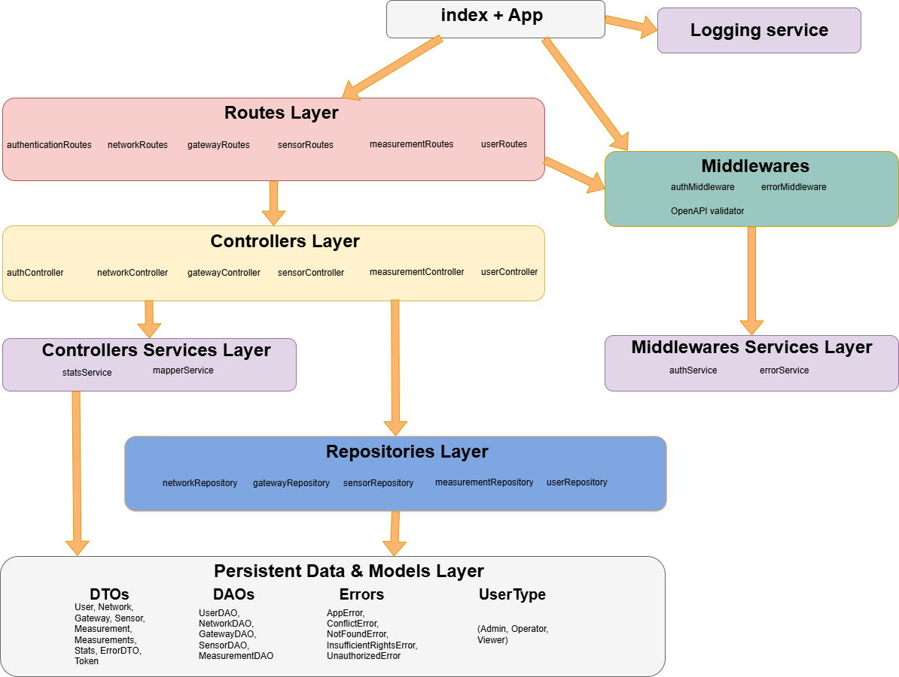
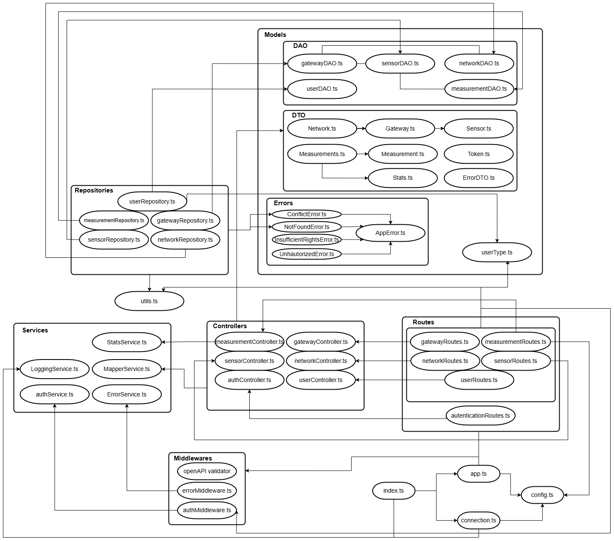
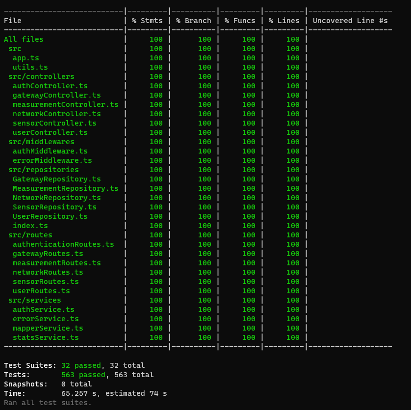

# Test Report

<The goal of this document is to explain how the application was tested, detailing how the test cases were defined and what they cover>

# Contents

- [Test Report](#test-report)
- [Contents](#contents)
- [Dependency graph](#dependency-graph)
- [Integration approach](#integration-approach)
- [Tests](#tests)
- [Coverage](#coverage)
  - [Coverage of FR](#coverage-of-fr)
  - [Coverage white box](#coverage-white-box)

# Dependency graph
1) A summarized, easy to read and top-down version of the dependency graph is this:

2) A more complete version of the dependency graph is this one:

# Integration approach

    <Write here the integration sequence you adopted, in general terms (top down, bottom up, mixed) and as sequence

    (ex: step1: unit A, step 2: unit A+B, step 3: unit A+B+C, etc)>

    <Some steps may  correspond to unit testing (ex step1 in ex above)>

    <One step will  correspond to API testing, or testing unit route.js>

In order to test the GeoControl API, we primarily adopted a **bottom up approach**. So, by looking at the first depedency graph we provided, which briefly illustrates the layers hierarchy, we started from the bottom and climbed the stack all the way up. The reason behind this is that this approach gave us the opportunity to perform **early defect detection**, so, start testing immediately after we wrote the DAOs and Repositories, and so on climbing up the stack. In other words, whenever we finished writing the code of a unit, we almost immediately tested it, before proceding with other units. The primary perk of this procedure is that it **improves product quality and reduces avoidable rework**. Acknowledging the potential for a slower development pace, we accepted this trade-off as we prioritize the robustness and quality of the GeoControl API over sheer overall development speed. 
While during each developmnent phase we also used some informal testing approaches along the way, here we represent and detail mainly the formalized tests.  
More in details, the testing sequence we adopted is composed of these steps:  
- **1: Repositories**
  - Approach: Unit testing $\rightarrow$ tested **R**
  - Description: At this level, we tested the Repositories. We both tested them using a real data source generated for the specific units tests (in our case it was a *Sqlite* database, interfaced and managed by our object relational mapper, TypeORM. The database lived in *RAM* and was deleted shortly after each test suite execution), and mocking the database in order to test the Repositories logic in a isolated way. 

- **2: Controllers and Controller Services (Mapper Service and Stats Service)**
  - Approach: Integration testing $\rightarrow$ integrated **C** + **S_ctrl**, with **R** mocked
  - Description: At this level we integrated and tested the Mapper and Stats Services with the Controllers. During these tests, the Repository layer was mocked. The main purpose of these tests was to verify the correct interaction, data flow, and contract adherence between the Controllers and Services. This ensures that business logic within Services is correctly invoked and handled by Controllers, independent of the actual database implementation.

- **3: Middlewares Services (Error Service and Auth Service)**
  - Approach: Unit testing $\rightarrow$ tested **S_mid**
  - Description: in this phase indivual services like the Error and the Auth one were unit tested. These two services are separated from the other as they are not used by the Controllers, but they are closely related to the Middlewares employed at the higher levels. So, we felt it was the right choice to test them during this step as they can be drawn at this level in the stack, as the first dependency graph clearly shows.  
  Here we verified the core business logic of each service. For Auth Service, for example, this included testing token generation and token processing.

- **4: Middlewares**
  - Approach: Unit testing $\rightarrow$ tested **M**, with **S_mid** mocked
  - Description: here we tested Individual middleware components, such as the Auth Middleware. This involved mocking the Services, tested in the previous steps, and testing the Middlewares' own logic. So, in this case the final goal was to ensure each Middleware worked in isolation, properly interacted with the Services it relies on (even if mocked), and correctly managed the request-response cycle.

- **5: Routes**
  - Approach: API testing $\rightarrow$ tested **Rt**, with **C**, **M** mocked
  - Description: in this step we Integrated and tested the routes endpoints of our server, which  which utilize the previously tested Middlewares and Controllers. So, Middlewares such the Auth Middleware, and all the Controllers, were mocked to conduct these tests. The main goal was to ensure that incoming API requests were correctly routed, that the routes function were able to exctract valid DTOs from the JSON body of the requests, and were also able to call the Auth Middleware and the Controller functions passing the right arguments. In addition, we tested that each route endpoint was able to correctly propagate the errors received either from the Auth Middleware, either from the lower units of the stack, to the Error Middleware.

- **6: Full System End To End (Routes + Middlewares + Services + Controllers + Repositories)**
  - Approach: End To End Testing $\rightarrow$ tested **Rt + C + M + S_ctrl + S_mid + R**
  - Description: in these final tests carried out tests to all the application stack as a whole, meaning we tested the real components, not mocking anything. We also interacted with a real database, generated the same way we did the the Repository tests at the step 1. These tests were crucial: we checked the complete system functionality and ensured all previously integrated components worked together harmoniously in a production-like environment. This verified that data flowed correctly through all layers from the API endpoint to the database and back, and that the system met the overall requirements
  

# Tests

<in the table below list the test cases defined For each test report the object tested, the test level (API, integration, unit) and the technique used to define the test case (BB/ eq partitioning, BB/ boundary, WB/ statement coverage, etc)> <split the table if needed>

|ID | Test case name | Object(s) tested | Test level | Technique used |
|---| :------------: | :--------------: | :--------: | :------------: |
| 1  | Get all sensors of a gateway - Admin                       | Sensors DTO                | API        | BB / EQ Partitioning, Role-based Access                        |
| 2  | Get all sensors of a gateway - Operator                    | Sensors DTO                | API        | BB / EQ Partitioning, Role-based Access                        |
| 3  | Get all sensors of a gateway - Viewer                      | Sensors DTO                | API        | BB / EQ Partitioning, Role-based Access                        |
| 4  | Get all sensors of a gateway - Unauthorized                | Auth Middleware            | API        | BB / EQ Partitioning (authorized vs unauthorized)              |
| 5  | Get all sensors of a gateway - Invalid Token               | Auth Middleware            | API        | BB / EQ Partitioning (valid vs invalid token)                  |
| 6  | Get all sensors of a gateway - 404 NetworkCode             | Network Existence Check    | API        | BB / EQ Partitioning (valid vs invalid network)                |
| 7  | Get all sensors of a gateway - 404 GatewayMac              | Gateway Existence Check    | API        | BB / EQ Partitioning (valid vs invalid gateway)                |
| 8  | Get all sensors of a gateway - empty gateway               | Sensors DTO (empty array)  | API        | BB / EQ Partitioning, Empty State Handling                     |
| 9  | Get specific sensor - Admin                                | Sensor DTO                 | API        | BB / EQ Partitioning, Role-based Access                        |
| 10 | Get specific sensor - Operator                             | Sensor DTO                 | API        | BB / EQ Partitioning, Role-based Access                        |
| 11 | Get specific sensor - Viewer                               | Sensor DTO                 | API        | BB / EQ Partitioning, Role-based Access                        |
| 12 | Get specific sensor - Unauthorized                         | Auth Middleware            | API        | BB / EQ Partitioning (authorized vs unauthorized)              |
| 13 | Get specific sensor - Invalid Token                        | Auth Middleware            | API        | BB / EQ Partitioning (valid vs invalid token)                  |
| 14 | Get specific sensor - 404 NetworkCode                      | Network Existence Check    | API        | BB / EQ Partitioning (valid vs invalid network)                |
| 15 | Get specific sensor - 404 GatewayMac                       | Gateway Existence Check    | API        | BB / EQ Partitioning (valid vs invalid gateway)                |
| 16 | Get specific sensor - 404 SensorMac                        | Sensor Existence Check     | API        | BB / EQ Partitioning (valid vs invalid sensor)                 |
| 17 | Get specific sensor - 404 All Path Params Wrong            | Entity Lookup Failure      | API        | BB / EQ Partitioning (invalid network, gateway, sensor)        |
| 18 | Create sensor - Admin                                      | Sensor DTO                 | API        | BB / EQ Partitioning, Role-based Access                        |
| 19 | Create sensor - Operator                                   | Sensor DTO                 | API        | BB / EQ Partitioning, Role-based Access                        |
| 20 | Create sensor - Viewer (forbidden)                         | Auth Middleware            | API        | BB / EQ Partitioning, Role-based Access                        |
| 21 | Create sensor - Nullable fields                            | Sensor DTO                 | API        | BB / EQ Partitioning, Optional Field Handling                  |
| 22 | Create sensor - Unauthorized (no token)                    | Auth Middleware            | API        | BB / EQ Partitioning (authorized vs unauthorized)              |
| 23 | Create sensor - Unauthorized (invalid token)               | Auth Middleware            | API        | BB / EQ Partitioning (valid vs invalid token)                  |
| 24 | Create sensor - Invalid input (missing field)              | Request Payload            | API        | BB / Input Validation, Required Field Enforcement              |
| 25 | Create sensor - Invalid input (wrong types)                | Request Payload            | API        | BB / Input Validation, Type Mismatch                           |
| 26 | Create sensor - Invalid input (empty body)                 | Request Payload            | API        | BB / Input Validation, Empty State                             |
| 27 | Create sensor - Not found (invalid network)                | Network Existence          | API        | BB / EQ Partitioning (existing vs non-existing ID)             |
| 28 | Create sensor - Not found (invalid gateway)                | Gateway Existence          | API        | BB / EQ Partitioning (existing vs non-existing ID)             |
| 29 | Create sensor - Conflict (duplicate MAC address)           | Uniqueness Constraint      | API        | BB / EQ Partitioning (unique vs duplicate)                     |
| 30 | Update a sensor - Admin                                    | Sensor DTO                 | API        | BB / EQ Partitioning, Role-based Access                        |
| 31 | Update a sensor - Operator                                 | Sensor DTO                 | API        | BB / EQ Partitioning, Role-based Access                        |
| 32 | Update a sensor - Viewer - 403 Insufficient Rights         | Auth Middleware            | API        | BB / EQ Partitioning, Role-based Access (forbidden roles)      |
| 33 | Update a sensor - 400 Bad Request (invalid fields)         | Request Payload            | API        | BB / Input Validation, Type Mismatch, Required Field Enforcement |
| 34 | Update a sensor - 401 Unauthorized (invalid token)         | Auth Middleware            | API        | BB / EQ Partitioning (valid vs invalid token)                  |
| 35 | Update a sensor - 404 Not Found (invalid network/gateway/sensor) | Entity Existence Check | API        | BB / EQ Partitioning (existing vs non-existing ID)             |
| 36 | Update a sensor - 409 Conflict (duplicate MAC address)     | Uniqueness Constraint      | API        | BB / EQ Partitioning (unique vs duplicate)                     |
| 37 | Delete a sensor - Admin                                    | None (204 No Content)      | API        | BB / EQ Partitioning, Role-based Access                        |
| 38 | Delete a sensor - Operator                                 | None (204 No Content)      | API        | BB / EQ Partitioning, Role-based Access                        |
| 39 | Delete a sensor - 403 Insufficient rights                  | Auth Middleware            | API        | BB / EQ Partitioning, Role-based Access (forbidden role)       |
| 40 | Delete a sensor - 401 Unauthorized                         | Auth Middleware            | API        | BB / EQ Partitioning (missing or invalid token)                |
| 41 | Delete a sensor - 404 Not Found                            | Entity Existence Check     | API        | BB / EQ Partitioning (non-existing network/gateway/sensor)     |
| 42 | Get gateways and nested sensors - Admin                       | Gateway DTO      | API    | BB / EQ Partitioning, Role-based Access (Admin)               |
| 43 | Get gateways and nested sensors - Operator                    | Gateway DTO      | API    | BB / EQ Partitioning, Role-based Access (Operator)            |
| 44 | Get gateways and nested sensors - Viewer                      | Gateway DTO      | API    | BB / EQ Partitioning, Role-based Access (Viewer)              |
| 45 | Get gateways and nested sensors - Unauthorized                | Auth Middleware  | API    | BB / EQ Partitioning (no or invalid token)                    |
| 46 | Get gateways and nested sensors - 404 Not Found               | Gateway DTO      | API    | BB / EQ Partitioning (non-existing network code)              |
| 47 | Get gateways and nested sensors - Empty network               | Gateway DTO      | API    | BB / EQ Partitioning (network with no gateways)               |
| 48 | Get a gateway and its nested sensors (0 sensors) - Admin      | Gateway DTO      | API    | BB / EQ Partitioning, Gateway without sensors                 |
| 49 | Get a gateway and its nested sensors - Operator               | Gateway DTO      | API    | BB / EQ Partitioning, Gateway with nested sensors (3)         |
| 50 | Get a gateway and its nested sensors - Viewer                 | Gateway DTO      | API    | BB / EQ Partitioning, Gateway with nested sensors (3)         |
| 51 | Get a gateway and its nested sensors - Unauthorized           | Auth Middleware  | API    | BB / EQ Partitioning, No or invalid token                     |
| 52 | Get a gateway and its nested sensors - 404 Not Found          | Gateway DTO      | API    | BB / EQ Partitioning, Non-existing network or gateway         |
| 53 | create a new gateway - Admin                           | Gateway DTO       | API            | BB / EQ Partitioning, Role-based Access (Admin)                  |
| 54 | create a new gateway - Operator                        | Gateway DTO       | API            | BB / EQ Partitioning, Nested Ignored Fields                      |
| 55 | create a new gateway - same mac address of an already existing sensor | Validation        | API            | BB / Unique Constraint (Sensor/Gateway MAC conflict - 409)       |
| 56 | create a new gateway - test nullable fields            | Gateway DTO       | API            | BB / Optional Fields Handling                                    |
| 57 | create a new gateway - Viewer                          | Auth Middleware   | API            | BB / Role-based Access (Viewer forbidden - 403)                  |
| 58 | create a new gateway - 400 Bad Request                 | Request Payload   | API            | BB / Input Validation (400 Bad Request)                          |
| 59 | create a new gateway - 401 Unauthorized                | Auth Middleware   | API            | BB / Auth Testing (no token, expired/invalid token - 401)        |
| 60 | create a new gateway - 403 Insufficient rights         | Auth Middleware   | API            | BB / Role-based Access (Viewer forbidden - 403)                  |
| 61 | create a new gateway - 404 Not Found                    | Network Existence | API            | BB / EQ Partitioning (non-existing network - 404)                |
| 62 | create a new gateway - 409 Conflict                     | Gateway Existence | API            | BB / Unique Constraint Violation (gateway MAC already exists - 409) |
| 63 | update a gateway - 409 Conflict - mac address used by a sensor | Validation        | API            | BB / Unique Constraint (Sensor/Gateway MAC conflict on PATCH - 409) |
| 64   | Get network - Admin                                     | Network DTO                 | API   | BB / EQ Partitioning, Role-based Access                        |
| 65   | Get network - Operator                                  | Network DTO                 | API   | BB / EQ Partitioning, Role-based Access                        |
| 66   | Get network - Viewer                                    | Network DTO                 | API   | BB / EQ Partitioning, Role-based Access                        |
| 67   | Create network - Admin                                  | Network DTO                 | API   | BB / EQ Partitioning, Role-based Access                        |
| 68   | Create network - Operator                               | Network DTO                 | API   | BB / EQ Partitioning, Role-based Access                        |
| 69   | Create network - Viewer (403)                           | Auth Middleware             | API   | BB / Role-based Access (forbidden role)                        |
| 70   | Create network - Invalid input                          | Request Payload             | API   | BB / Boundary Testing, Input Format Validation                 |
| 71   | Create network - Unauthorized                           | Auth Middleware             | API   | BB / Auth Testing (invalid/expired token)                      |
| 72   | Create network - Conflict (409)                         | Network Existence           | API   | BB / EQ Partitioning (duplicate resource)                      |
| 73   | Get network (Admin)                                     | Network DTO                 | API   | BB / EQ Partitioning, Role-based Access                        |
| 74   | Get network (Operator)                                  | Network DTO                 | API   | BB / EQ Partitioning, Role-based Access                        |
| 75   | Get network (Viewer)                                    | Network DTO                 | API   | BB / EQ Partitioning, Role-based Access                        |
| 76   | Get network - nested gateways (Admin)                   | Network + Gateways DTO      | API   | BB / Nested Resources, Structure Validation                    |
| 77   | Get network - nullable fields (Admin)                   | Network DTO                 | API   | BB / Nullable Fields Handling                                  |
| 78   | Get network - 401 Unauthorized (Admin)                  | Auth Middleware             | API   | BB / Auth Testing (invalid/expired token)                      |
| 79   | Get network - 404 Not Found (Admin)                     | Network Existence           | API   | BB / EQ Partitioning (non-existing resource)                   |
| 80   | Get all networks (Admin)                                | Network DTO                 | API   | BB / EQ Partitioning, Role-based Access                        |
| 81   | Get all networks (Operator)                             | Network DTO                 | API   | BB / EQ Partitioning, Role-based Access                        |
| 82   | Get all networks (Viewer)                               | Network DTO                 | API   | BB / EQ Partitioning, Role-based Access                        |
| 83   | Get all networks - 401 Unauthorized (Admin)             | Auth Middleware             | API   | BB / Auth Testing (invalid/expired token)                      |
| 84   | Update a network - name, description (Admin)            | Network DTO                 | API   | BB / EQ Partitioning, Role-based Access (Admin can update)     |
| 85   | Update a network - name, description (Operator)         | Network DTO                 | API   | BB / EQ Partitioning, Role-based Access (Operator can update)  |
| 86   | Update a network - name, description (Viewer)           | Authorization              | API   | BB / Role-based Access (Viewer forbidden - 403)                |
| 87   | Update a network - networkCode (Admin)                  | Network DTO                 | API   | BB / Unique constraints, Update primary key (code)             |
| 88   | Update a network - 400 Bad Request (Admin)              | Validation                 | API   | BB / Input validation (invalid types)                          |
| 89   | Update a network - 401 Unauthorized (Admin)             | Authorization              | API   | BB / Auth invalid token (401)                                  |
| 90   | Update a network - 404 Not Found (Admin)                | Data access                | API   | BB / Non-existing resource (404)                               |
| 91   | Update a network - 409 Conflict (Admin)                 | Data integrity             | API   | BB / Unique constraint violation (code already exists)         |
| 92   | Delete a network (Admin)                                | Network DTO                 | API   | BB / Role-based Access (Admin can delete)                      |
| 93   | Delete a network (Operator)                             | Network DTO                 | API   | BB / Role-based Access (Operator can delete)                   |
| 94   | Delete a network (Viewer)                               | Authorization              | API   | BB / Role-based Access (Viewer forbidden - 403)                |
| 95   | Delete a network - 401 Unauthorized (Admin)             | Authorization              | API   | BB / Auth invalid token (401)                                  |
| 96   | Delete a network - 404 Not Found (Admin)                | Data access                | API   | BB / Resource not found (already deleted or missing)           |
| 97   | Get measurements for a network - Admin                 | Measurements DTO            | API   | BB / EQ Partitioning, Role-based Access                        |
| 98   | Get measurements for a network - Operator              | Measurements DTO            | API   | BB / EQ Partitioning, Role-based Access                        |
| 99   | Get measurements for a network - Viewer                | Measurements DTO            | API   | BB / EQ Partitioning, Empty State Handling                     |
| 100  | Get measurements for a network - invalid input data    | Query Parameter Validation  | API   | BB / Boundary Testing, Input Validation                        |
| 101  | Get measurements for a network - Unauthorized          | Authorization Middleware    | API   | BB / EQ Partitioning (authorized vs unauthorized)             |
| 102  | Get measurements for a network - 404 Not Found         | Network Existence Check     | API   | BB / EQ Partitioning (valid vs invalid ID)                     |
| 103  | Get measurements for a network - Empty Network         | Measurements DTO (Empty)    | API   | BB / EQ Partitioning, Empty State Handling                     |
| 104  | Get stats for network - Admin                           | Stats DTO                  | API   | BB / EQ Partitioning, Role-based Access                        |
| 105  | Get stats for network - Operator                        | Stats DTO                  | API   | BB / EQ Partitioning, Role-based Access                        |
| 106  | Get stats for network - Viewer                          | Stats DTO                  | API   | BB / EQ Partitioning, Role-based Access                        |
| 107  | Get stats for network - invalid input data (startDate) | Query Parameter            | API   | BB / Boundary Testing, Input Format Validation                 |
| 108  | Get stats for network - invalid input data (endDate)   | Query Parameter            | API   | BB / Boundary Testing, Input Format Validation                 |
| 109  | Get stats for network - Unauthorized (no token)        | Auth Middleware            | API   | BB / EQ Partitioning (authorized vs unauthorized)             |
| 110  | Get stats for network - Unauthorized (invalid token)   | Auth Middleware            | API   | BB / EQ Partitioning (valid vs invalid token)                 |
| 111  | Get stats for network - 404 Not Found                   | Network Existence          | API   | BB / EQ Partitioning (existing vs non-existing ID)            |
| 112  | Get stats for network - empty network (no measurements) | Stats DTO (Empty)          | API   | BB / EQ Partitioning, Empty State Handling                     |
| 113  | Get outlier measurements - Admin                        | Measurement DTO            | API   | BB / EQ Partitioning, Role-based Access                        |
| 114  | Get outlier measurements - Operator                     | Measurement DTO            | API   | BB / EQ Partitioning, Role-based Access                        |
| 115  | Get outlier measurements - Viewer                       | Measurement DTO            | API   | BB / EQ Partitioning, Role-based Access                        |
| 116  | Get outlier measurements - invalid input data (startDate) | Query Parameter          | API   | BB / Boundary Testing, Input Format Validation                 |
| 117  | Get outlier measurements - Unauthorized (no token)     | Auth Middleware            | API   | BB / EQ Partitioning (authorized vs unauthorized)             |
| 118  | Get outlier measurements - Unauthorized (invalid token) | Auth Middleware           | API   | BB / EQ Partitioning (valid vs invalid token)                 |
| 119  | Get outlier measurements - 404 Not Found                | Network Existence          | API   | BB / EQ Partitioning (existing vs non-existing ID)            |
| 120  | Get outlier measurements - empty network                | Measurement DTO (Empty)    | API   | BB / EQ Partitioning, Empty State Handling                     |
| 121  | Store measurement - Admin                               | Measurement DTO            | API   | BB / EQ Partitioning, Role-based Access                        |
| 122  | Store measurement - Operator                            | Measurement DTO            | API   | BB / EQ Partitioning, Role-based Access                        |
| 123  | Store measurement - Viewer (forbidden)                 | Auth Middleware            | API   | BB / EQ Partitioning, Role-based Access                        |
| 124  | Store measurement - Unauthorized (no token)            | Auth Middleware            | API   | BB / EQ Partitioning (authorized vs unauthorized)             |
| 125  | Store measurement - Invalid input data                 | Request Payload            | API   | BB / Boundary Testing, Input Format Validation                 |
| 126  | Store measurement - Not found (invalid network)        | Network Existence          | API   | BB / EQ Partitioning (existing vs non-existing ID)            |
| 127  | Store measurement - Not found (invalid gateway)        | Gateway Existence          | API   | BB / EQ Partitioning (existing vs non-existing ID)            |
| 128  | Store measurement - Not found (invalid sensor)         | Sensor Existence           | API   | BB / EQ Partitioning (existing vs non-existing ID)            |
| 129  | Get measurements for a sensor - Admin                   | Measurements DTO           | API   | BB / EQ Partitioning, Role-based Access                        |
| 130  | Get measurements for a sensor - Operator                | Measurements DTO           | API   | BB / EQ Partitioning, Role-based Access                        |
| 131  | Get measurements for a sensor - Viewer                  | Measurements DTO           | API   | BB / EQ Partitioning, Role-based Access                        |
| 132  | Get measurements - invalid startDate format             | Query Parameter            | API   | BB / Boundary Testing, Input Format Validation                 |
| 133  | Get measurements - unauthorized (no token)              | Auth Middleware            | API   | BB / EQ Partitioning (authorized vs unauthorized)             |
| 134  | Get measurements - unauthorized (invalid token)         | Auth Middleware            | API   | BB / EQ Partitioning (valid vs invalid token)                 |
| 135  | Get measurements - 404 sensor/gateway/network not found | Entity Existence           | API   | BB / EQ Partitioning (existing vs non-existing ID)            |
| 136  | Get measurements - empty sensor (no measurements)       | Measurements DTO (Empty)   | API   | BB / EQ Partitioning, Empty State Handling                     |
| 137  | Get stats for sensor - Admin                             | Stats DTO                  | API   | BB / EQ Partitioning, Role-based Access                        |
| 138  | Get stats for sensor - Operator                          | Stats DTO                  | API   | BB / EQ Partitioning, Role-based Access                        |
| 139  | Get stats for sensor - Viewer                            | Stats DTO                  | API   | BB / EQ Partitioning, Role-based Access                        |
| 140  | Get stats for sensor - invalid startDate                | Query Parameter            | API   | BB / Boundary Testing, Input Format Validation                 |
| 141  | Get stats for sensor - invalid endDate                  | Query Parameter            | API   | BB / Boundary Testing, Input Format Validation                 |
| 142  | Get stats for sensor - Unauthorized (no token)          | Auth Middleware            | API   | BB / EQ Partitioning (authorized vs unauthorized)             |
| 143  | Get stats for sensor - Unauthorized (bad token)         | Auth Middleware            | API   | BB / EQ Partitioning (valid vs invalid token)                 |
| 144  | Get stats for sensor - Not Found                         | Entity Existence           | API   | BB / EQ Partitioning (existing vs non-existing ID)            |
| 145  | Get stats for sensor - empty sensor (no measurements)   | Stats DTO (Empty)          | API   | BB / EQ Partitioning, Empty State Handling                     |
| 146  | Get outliers for sensor - Admin                          | Measurements DTO           | API   | BB / EQ Partitioning, Role-based Access                        |
| 147  | Get outliers for sensor - Operator                       | Measurements DTO           | API   | BB / EQ Partitioning, Role-based Access                        |
| 148  | Get outliers for sensor - Viewer                         | Measurements DTO           | API   | BB / EQ Partitioning, Role-based Access                        |
| 149  | Get outliers - invalid startDate                         | Query Parameter            | API   | BB / Input Validation, Boundary Testing                        |
| 150  | Get outliers - invalid endDate                           | Query Parameter            | API   | BB / Input Validation, Boundary Testing                        |
| 151  | Get outliers - Unauthorized (no token)                  | Auth Middleware            | API   | BB / EQ Partitioning (authorized vs unauthorized)             |
| 152  | Get outliers - Unauthorized (invalid token)             | Auth Middleware            | API   | BB / EQ Partitioning (valid vs invalid token)                 |
| 153  | Get outliers - Not Found                                 | Entity Existence           | API   | BB / EQ Partitioning (existing vs non-existing)               |
| 154  | Get outliers - sensor with no outliers                   | Measurements DTO (empty)   | API   | BB / EQ Partitioning, Empty State Handling                     |
| 155  | get measurements for network - empty network               | Measurements DTO (empty array) | API | BB / EQ Partitioning, Empty State Handling                     |
| 156  | get measurements for network - not empty network           | Measurements DTO (array)     | API   | BB / EQ Partitioning                                           |
| 157  | get measurements for network - specify sensorMacs          | Measurements DTO (filtered array) | API | BB / EQ Partitioning, Data Validation (stats calc)           |
| 158  | get measurements for network - empty query param sensorMacs| Query Parameter             | API   | BB / Input Validation, Boundary Testing                        |

# Coverage

## Coverage of FR

<Report in the following table the coverage of functional requirements and scenarios(from official requirements) >

| Functional Requirement or scenario | Test(s) |
| :--------------------------------: | :-----: |
|                FR 3.1                 |   80-83      |
|                FR 3.2                 |   67-72      |
|                FR 3.3                 |    64-66, 73-79    |
|                FR 3.4                 |      84-91   |
|                FR 3.5                 |   92-96      |
|                FR 4.1                |  42-47       |
|                FR 4.2              |    53-62     |
|                FR 4.3             |     48-52    |
|                FR 4.4                |   63      |
|                FR 4.5             |         |
|                FR 5.1                |   1-8      |
|                FR 5.2                |  18-29       |
|                FR 5.3                |   9-17      |
|                FR 5.4                |     30-36   |
|                FR 5.5                |   37-41     |
|                FR 6.1                |   97-103     |
|                FR 6.2                |    104-112    |
|                FR 6.3                |    113-120    |
|                FR 6.4                |    121-128    |
|                FR 6.5                |    129-136    |
|                FR 6.6                |    137-145    |
|                FR 6.7                |    146-158    |

## Coverage white box

Report here the screenshot of coverage values obtained with jest-- coverage
